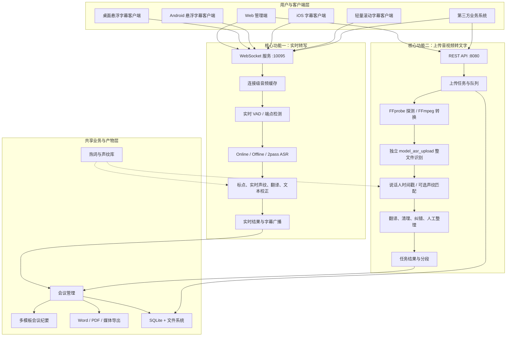
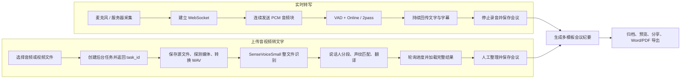
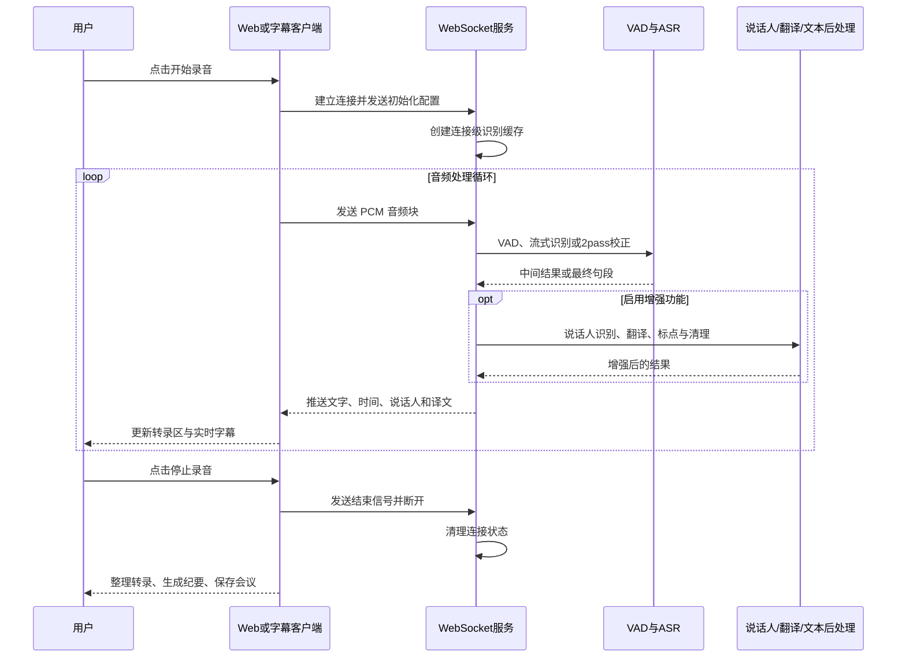
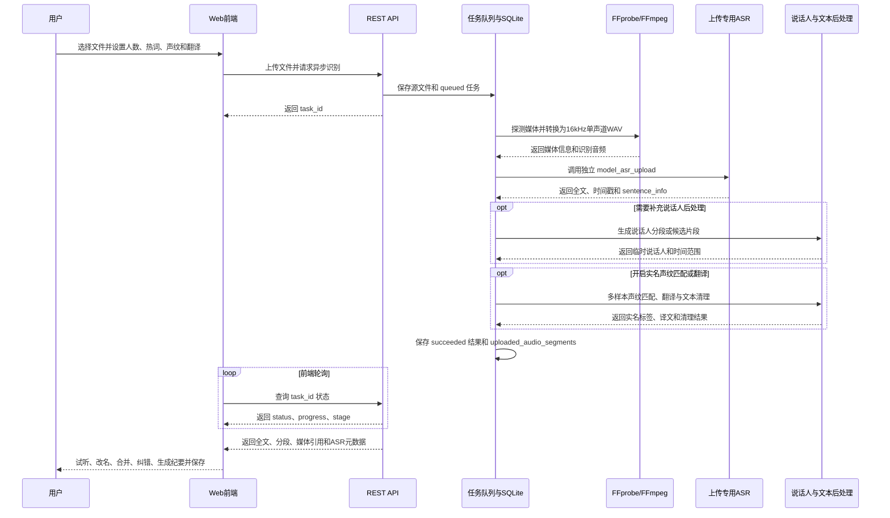
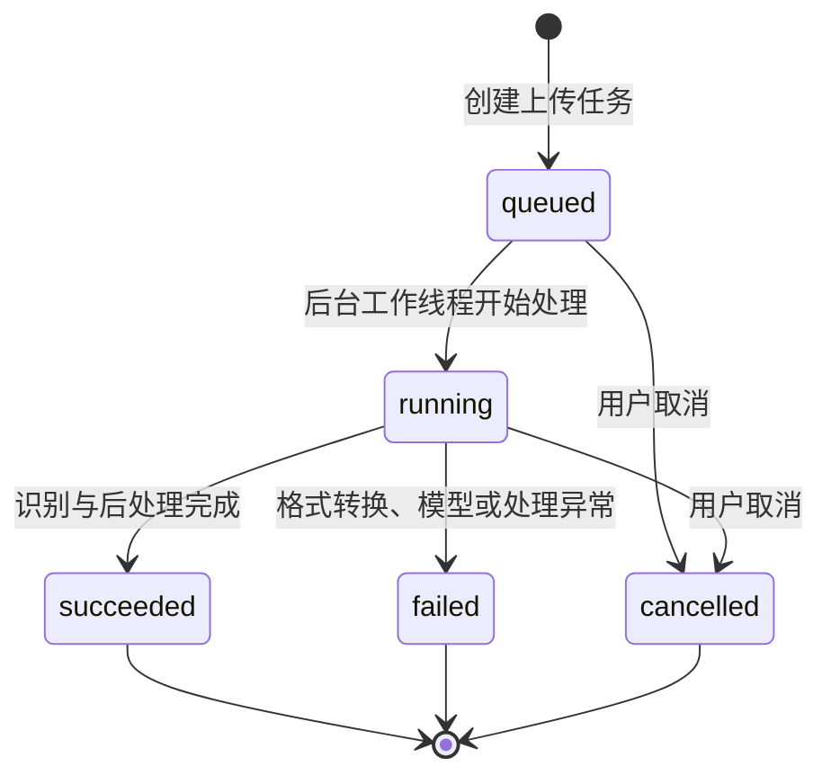
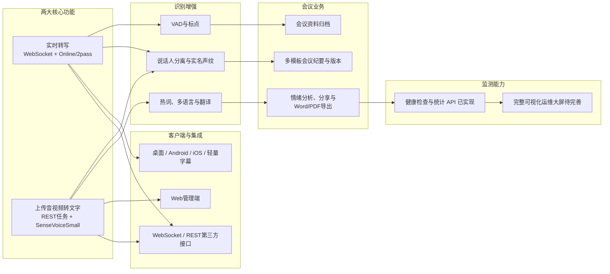
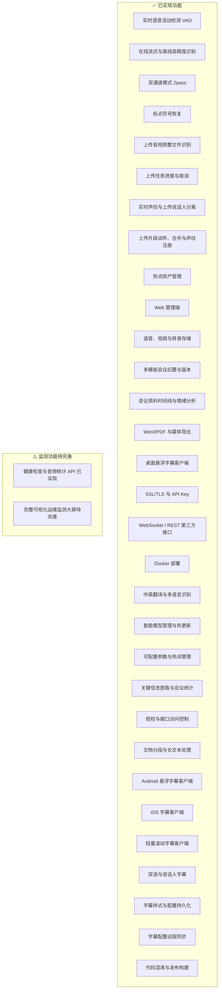

# WYL ASR - 实时转写与上传音视频转文字平台


## 📖 项目简介

WYL ASR 是一个面向会议、访谈、培训、媒体资料和业务录音的语音内容处理平台。系统基于 FunASR 构建，将以下两项能力作为同等重要、相互独立的核心功能：

1. **实时转写**：通过 WebSocket 持续接收麦克风或音频设备的实时音频流，边说边显示文字，并可使用 2pass 模式对流式结果进行校正。
2. **上传音视频转文字**：通过 REST API 上传已有音频或视频文件，以后台任务方式完成媒体转换、整文件识别、说话人分段、声纹匹配、翻译和结果整理。

两条链路共用会议管理、热词、说话人声纹库、翻译、会议纪要、Word/PDF 导出和资料归档能力，但使用不同的传输协议、任务状态、模型实例和处理参数。上传识别不是实时转写的“文件输入模式”，也不是 `2pass-offline` 的复用入口。

### 🎯 双核心功能

| 对比项 | 实时转写 | 上传音视频转文字 |
|--------|----------|------------------|
| 典型场景 | 正在进行的会议、访谈、直播字幕 | 已有录音、会议录像、课程视频、历史资料 |
| 输入方式 | 麦克风、服务器采集设备、实时 PCM 音频流 | 本地音频或视频文件 |
| 通信方式 | WebSocket 长连接 | HTTP REST 上传 + 后台任务轮询 |
| 核心模型 | Online ASR / Offline ASR / 2pass | 独立 `model_asr_upload`，默认 SenseVoiceSmall |
| 结果节奏 | 持续返回中间结果和最终结果 | 完成各处理阶段后返回整份任务结果 |
| 任务状态 | 连接、录音、识别、停止 | `queued`、`running`、`succeeded`、`failed`、`cancelled` |
| 说话人能力 | 实时声纹识别、人工指定发言人 | 音频内说话人分离、可选实名声纹匹配、人工整理 |
| 主要产物 | 实时字幕、录音、转录稿、会议纪要 | 源音视频、转录稿、时间戳分段、会议纪要 |

### ✨ 配套功能

- **语音处理**：VAD、标点恢复、多语言识别、本地中英翻译、热词增强。
- **说话人处理**：说话人注册、实时识别、上传分离、实名声纹匹配、试听、更名、合并和校正。
- **会议纪要**：支持标准会议纪要、方案评审纪要等多模板生成，支持长文本分段总结和纪要版本修订。
- **会议资料**：统一保存源音视频、转录稿、纪要版本、情绪分析和其他会议文档。
- **导出分享**：支持转录稿和会议纪要 Word/PDF 导出、原始媒体下载及分享。
- **多端展示**：Web 管理端、Windows/macOS/Linux 桌面字幕、Android 悬浮字幕、iOS 字幕和轻量滚动字幕客户端。
- **服务治理**：模型管理、API 鉴权、SSL/TLS、运行统计、健康检查和 Docker 部署。

### ✨ 功能完成情况

本清单保留项目原有的逐项完成情况表达，并结合当前代码补充上传音视频转文字、会议产物和客户端能力。

**状态说明**：`✅✅` 已完成并可使用；`⚠️⚠️` 已有基础能力但完整监测功能仍在建设。

1. 🎤 **实时语音活动检测（VAD）** `✅✅` - 智能检测语音片段，过滤静音。
2. 🌊 **在线流式语音识别** `✅✅` - 支持低延迟实时识别和中间结果持续输出。
3. 🎯 **离线高精度语音识别** `✅✅` - 支持完整语音段的高精度转录。
4. 📝 **标点符号恢复** `✅✅` - 自动添加标点，提升转录可读性。
5. 🔄 **双通道模式（2pass）** `✅✅` - 结合在线反馈和离线校正。
6. 👥 **说话人识别与分离** `✅✅` - 支持实时声纹识别、上传说话人分离、实名匹配和人工校正。
7. 📁 **上传音视频转文字** `✅✅` - 支持整文件识别，支持音视频转换、时间戳分段和结果归档。
8. 🌐 **中英翻译** `✅✅` - 支持实时转写和上传音视频转文字的本地中英翻译。
9. ✂️ **实时/上传分段** `✅✅` - 实时链路按语音端点输出，上传链路按时间戳和说话人生成展示段落。
10. 🤖 **智能模型管理** `✅✅` - 支持模型下载、检查、路径整理和启动加载。
11. 🔒 **SSL/TLS 支持** `✅✅` - 支持 HTTPS/WSS 加密连接。
12. 📊 **实时性能监控** `⚠️⚠️` - 已提供健康检查和音频统计 API，可视化运维大屏待完善。
13. 🔧 **可配置参数** `✅✅` - 支持网络、识别、模型、硬件、线程、说话人和翻译参数配置。
14. 🌍 **多语言支持** `✅✅` - 支持中文、英文及模型提供的多种语言识别。
15. 🔄 **模型热更新与自动整理** `✅✅` - 支持模型下载、整理、重新加载和更新管理。
16. 🔥 **热词管理** `✅✅` - 支持增删改查、权重、分类、保护、导入导出和上传范围选择。
17. 🌐 **Web 前端** `✅✅` - 提供实时转写、上传转写、会议管理、热词、说话人和系统设置界面。
18. 📱 **客户端应用** `✅✅` - 支持 Windows、macOS、Linux、Android、iOS 和轻量字幕客户端。
19. 💾 **语音与源媒体存储** `✅✅` - 支持实时录音、原始上传音频和视频文件存储与管理。
20. 📄 **转录结果存储** `✅✅` - 支持全文、分段、时间戳、说话人、译文和来源信息持久化。
21. 📝 **会议纪要存储** `✅✅` - 支持会议纪要及多个历史版本保存。
22. 📋 **会议纪要生成** `✅✅` - 支持 AI 生成、长文本分段处理和多模板结构化输出。
23. 🎯 **关键信息提取** `✅✅` - 支持从会议内容中提取摘要、议题、决议、待办和后续安排。
24. 📊 **会议统计与分析** `✅✅` - 支持发言、任务、参与情况和情绪分析。
25. 🔌 **第三方接口对接** `✅✅` - 提供 WebSocket、REST API、文件下载及会议数据对接能力。
26. 🔐 **授权管理** `✅✅` - 支持 API Key、Bearer Token、CORS 和接口访问控制。
27. 🛡️ **代码混淆** `✅✅` - 提供代码混淆和发布构建能力。
28. ⏳ **上传任务队列与进度** `✅✅` - 支持排队、运行、成功、失败、取消和阶段进度展示。
29. 🎧 **上传说话人整理** `✅✅` - 支持片段试听、单段改名、整人更名、合并和声纹注册。
30. 🧾 **会议纪要多模板** `✅✅` - 已提供标准会议纪要和方案评审纪要，并支持模板扩展。
31. 🗂️ **会议纪要版本与修订** `✅✅` - 支持保留版本、选择当前版本和按自然语言要求生成新版。
32. 🕒 **会议资料时间线** `✅✅` - 统一展示源媒体、转录稿、会议纪要、情绪分析和其他文档。
33. 📑 **Word/PDF 导出** `✅✅` - 支持转录稿、会议纪要和分析文档导出。
34. 📡 **字幕配置远程同步** `✅✅` - Web 端保存字幕配置后可广播给在线客户端。
35. 🖥️ **桌面悬浮字幕客户端** `✅✅` - 支持 Windows、macOS、Linux，无边框置顶、拖动定位和窗口位置记忆。
36. 📱 **Android 悬浮字幕客户端** `✅✅` - 支持系统悬浮窗、前台服务和切换其他应用后持续显示字幕。
37. 🍎 **iOS 字幕客户端** `✅✅` - 提供 `net8.0-ios` 工程、实时字幕界面和构建入口。
38. 📺 **轻量滚动字幕客户端** `✅✅` - 面向大屏、第二显示器、直播和 OBS，支持连续累加、自动换行与滚动。
39. 🗣️ **双语与说话人字幕** `✅✅` - 支持原文、译文和当前发言人同步显示。
40. 🎨 **字幕样式与配置持久化** `✅✅` - 支持字体、字号、颜色、背景、透明度、宽度、圆角、行数和滚动速度设置。
41. 🐳 **Docker 部署** `✅✅` - 支持容器化部署。

### 📺 字幕客户端功能矩阵

| 客户端 | 运行平台 | 主要使用场景 | 已实现能力 |
|--------|----------|--------------|------------|
| 桌面悬浮字幕 | Windows、macOS、Linux | 现场会议、演示、桌面辅助字幕 | 实时连接、无边框置顶、拖动、位置记忆、双语、说话人和样式设置 |
| Android 悬浮字幕 | Android | 移动会议、投屏、在其他应用上层显示 | 系统悬浮窗权限、前台服务、后台持续显示、实时连接和字幕设置 |
| iOS 字幕客户端 | iOS | 移动端实时字幕与会议展示 | `net8.0-ios` 工程、WebSocket 实时字幕、双语和说话人显示 |
| 轻量滚动字幕 | Windows、macOS、Linux | 会议大屏、第二屏、直播和 OBS | 手动连接、说话人前缀、同人内容累加、自动换行滚动、清空和置顶 |

所有字幕客户端通过 WebSocket 接收实时转写和 2pass 校正结果。Web 管理端保存字幕设置后，可将配置广播给在线客户端；客户端本地也会保存连接地址、显示样式和窗口位置。

### 📝 会议纪要模板

会议纪要生成支持前端选择模板，默认保留原有“标准会议纪要”模板，不改变旧流程。新增“方案评审纪要”模板，用于方案评审会、产品需求会、系统优化评审等场景，输出结构包含“会议主题、发言人、会议摘要、按主题归类的议题、待办事项”。

当转录内容较长进入分段处理时，分段片段生成逻辑和提示词保持不变；最终整篇直传或多段合并阶段会使用当前选择的模板，保证最终纪要格式一致。模板选择会保存在浏览器本地，下次生成默认沿用上次选择。


## 🚀 核心优势与技术特点

### 1. 🎯 两条独立识别链路

- **低延迟流式识别**: 采用 WebSocket 二进制协议，音频数据实时传输，识别结果毫秒级返回，适合交互式应用
- **双通道模式 (2pass)**: 在线流式与离线高精度识别结合，兼顾速度与准确率
- **上传文件整段识别**: 上传文件走独立的 SenseVoiceSmall 后台任务链路，与实时转写和 `2pass-offline` 参数隔离
- **资源与参数隔离**: 实时链路按连接维护缓存，上传链路按任务持久化进度和结果，互不混用上下文

### 2. 🧠 智能语音处理

- **语音活动检测 (VAD)** : 内置 VAD 模型，自动过滤静音和噪声片段，提升识别效率
- **标点恢复**: 自动添加标点，输出更易读文本
- **说话人识别与分离**: 实时链路支持声纹识别和人工指定发言人；上传主链路优先使用 FunASR `sentence_info` 的说话人和时间戳结果，必要时再执行 VAD/声纹后处理，并可与本地声纹库比对

### 3. 🌍 多语言与翻译支持

- **多语言识别**: 支持中文、英文等主流语种，易于扩展其他语言
- **实时与上传翻译**: 内置本地中英互译入口，实时转写和上传文件识别均可按开关返回译文

### 4. ⚙️ 灵活配置与模型管理

- **参数可配置**: 识别模式、采样率、VAD阈值等均可通过命令行或 API 灵活调整
- **智能模型管理**: 自动下载、校验和整理模型文件，支持热更新，保障服务稳定

### 5. 🔒 安全与可靠性

- **SSL/TLS 加密**: 支持 HTTPS/WSS 安全连接，保障数据传输安全
- **性能监控**: 实时统计内存占用与处理时长，便于运维优化

### 6. 🛠️ 易用性与扩展性

- **标准 API 接口**: 实时转写提供 WebSocket 接口，上传识别和会议资料提供 REST API
- **丰富测试工具**: 内置多种测试脚本和报告，便于开发、调试和性能验证
- **容器化部署**: 支持 Docker 快速部署，适应多种生产环境

> **WYL ASR 致力于为开发者和企业提供高效、稳定、易扩展的语音识别服务。**

### 🎵 支持格式

- **音频格式**: 16kHz, 16bit, PCM
- **上传文件格式**: `.wav`, `.mp3`, `.flac`, `.m4a`, `.aac`, `.ogg`, `.webm`, `.mp4`, `.mov`, `.mkv`, `.avi` 等音视频文件
- **网络协议**: WebSocket with binary subprotocol
- **语言支持**: 中文 (可扩展)
- **并发模式**: 单客户端连接 (v1.0)

## 🏗️ 项目架构

```
wyl_asr/
├── main.py                 # 🚀 主程序入口
├── organize_models.py      # 🤖 模型管理工具
├── src/                    # 📦 源代码目录
│   └── modules/           # 🧠 核心模块
│       ├── __init__.py    # 📋 模块初始化
│       ├── audio/         # 🎵 音频处理模块
│       │   ├── __init__.py
│       │   ├── audio_duration_handler.py  # ⏱️ 音频时长处理
│       │   ├── audio_format_handler.py    # 🔄 音频格式处理
│       │   ├── audio_processing.py        # 🎵 音频处理核心
│       │   └── vad_monitor.py             # 🔍 VAD监控
│       ├── config/        # ⚙️ 配置管理模块
│       │   ├── __init__.py
│       │   ├── arg_parser.py              # ⚙️ 命令行参数解析
│       │   ├── logging_config.py          # 📝 日志配置
│       │   └── ssl_config.py              # 🔒 SSL配置
│       ├── core/          # 🧠 核心服务模块
│       │   ├── __init__.py
│       │   ├── core.py                    # 🎯 核心接口导出
│       │   ├── document_segmentation_service.py # 📄 文档分段服务
│       │   └── server_state.py            # 🏪 服务器状态管理
│       ├── database/      # 💾 数据库模块
│       │   ├── __init__.py
│       │   ├── database_api.py            # 🌐 数据库API接口
│       │   └── database_manager.py        # 💾 数据库管理
│       ├── network/       # 🌐 网络服务模块
│       │   ├── __init__.py
│       │   ├── start_api.py               # 🚀 API服务启动脚本
│       │   ├── translation_service.py     # 🌐 翻译服务
│       │   ├── websocket_manager.py       # 🔌 WebSocket连接管理
│       │   └── websocket_service.py       # 🌐 WebSocket服务逻辑
│       └── speaker/       # 👥 说话人识别模块
│           ├── __init__.py
│           ├── hotword_manager.py         # 🔥 热词管理
│           ├── speaker_labeling.py        # 🏷️ 说话人标注
│           ├── speaker_manager.py         # 👥 说话人管理
│           └── speaker_verification.py    # 🆔 说话人验证
├── tests/                  # 🧪 测试文件
│   ├── audio_analysis_report.json  # 📊 音频分析报告
│   ├── audio_device_test.py        # 🎧 音频设备测试
│   ├── check_models.py             # 🔍 模型完整性检查
│   └── test_*.py                   # 🧪 各种功能测试文件
├── ui/                     # 🎨 前端界面
│   ├── src/               # 📦 前端源代码
│   │   ├── components/    # 🧩 Vue组件
│   │   │   ├── AsrPanel.vue        # 🎤 语音识别面板
│   │   │   ├── HomePage.vue        # 🏠 主页组件
│   │   │   ├── RecordPage.vue      # 📹 录音页面
│   │   │   ├── MeetingDetail.vue   # 📋 会议详情
│   │   │   └── ShareDialog.vue     # 📤 分享对话框
│   │   ├── stores/        # 🗄️ 状态管理
│   │   │   └── asr.ts             # 🎯 ASR状态管理
│   │   ├── api/           # 🌐 API接口
│   │   └── config/        # ⚙️ 前端配置
│   ├── package.json       # 📦 前端依赖
│   └── vite.config.ts     # ⚡ Vite配置
├── VoiceRecognitionDisplay/ # 🖥️ 跨平台字幕客户端
│   ├── VoiceRecognitionDisplay/         # 🧩 客户端共享核心与界面
│   ├── VoiceRecognitionDisplay.Desktop/ # 🖥️ Windows/macOS/Linux 桌面客户端
│   ├── VoiceRecognitionDisplay.Android/ # 📱 Android 悬浮字幕客户端
│   ├── VoiceRecognitionDisplay.iOS/     # 🍎 iOS 字幕客户端
│   ├── VoiceRecognitionDisplay.macOS/   # 🍎 macOS 原生客户端入口
│   ├── VoiceRecognitionDisplay.Linux/   # 🐧 Linux 客户端入口
│   ├── VoiceRecognitionDisplay.Tests/   # 🧪 客户端测试工程
│   └── VoiceRecognitionDisplay.sln      # 🧱 客户端解决方案
├── subtitle_display/       # 📺 轻量滚动字幕客户端
│   ├── App.axaml           # 🎨 客户端界面
│   ├── MainWindow.axaml    # 🪟 主窗口
│   ├── SubtitleDisplay.csproj # 🧱 客户端工程配置
│   └── README.md           # 📖 轻量客户端说明
├── config/                 # ⚙️ 配置文件
│   └── config.py          # 📋 项目配置
├── utils/                  # 🛠️ 工具函数
│   └── helpers.py         # 🔧 辅助工具函数
├── models/                 # 🧠 AI模型文件
│   ├── SenseVoiceSmall/   # 🎯 离线ASR模型
│   ├── speech_paraformer-large-vad-punc_asr_nat-zh-cn-16k-common-vocab8404-onnx/ # 🌊 ONNX ASR模型
│   ├── speech_seaco_paraformer_large_asr_nat-zh-cn-16k-common-vocab8404-pytorch/ # 🔥 PyTorch ASR模型
│   ├── punc_ct-transformer_zh-cn-common-vocab272727-pytorch/ # 📝 标点恢复模型
│   └── speech_fsmn_vad_zh-cn-16k-common-pytorch/ # 🎤 VAD检测模型
├── docs/                   # 📚 文档目录
├── logs/                   # 📝 日志目录
├── data/                   # 💾 数据目录
│   ├── audio/             # 🎵 音频文件存储
│   └── documents/         # 📄 文档文件存储
├── scripts/                # 📜 脚本文件
│   ├── build_obfuscated.sh        # 🛡️ 代码混淆构建
│   └── obfuscate_python.py        # 🔒 Python代码混淆
├── requirements.txt        # 📦 项目依赖
├── requirements-dev.txt    # 🔧 开发环境依赖
├── pyproject.toml         # 🏗️ 项目构建配置
├── Dockerfile             # 🐳 Docker配置
├── CONTRIBUTING.md        # 🤝 贡献指南
├── LICENSE                # 📜 许可证
└── README.md              # 📖 项目说明
```

## 🤖 模型管理

### 支持的模型

项目支持多种 FunASR 模型：

- **语音识别模型**：SenseVoiceSmall、paraformer-zh、paraformer-en 等
- **上传识别模型**：独立 `model_asr_upload`，默认 SenseVoiceSmall
- **语音活动检测**：fsmn-vad、silero-vad 等
- **标点恢复模型**：ct-punc 等
- **说话人识别模型**：cam++、ecapa-tdnn 等
- **翻译模型**：opus-mt-zh-en 等

### 模型下载与管理

#### 自动下载

```bash
# 下载所有必需模型
python organize_models.py

# 检查模型完整性
python tests/check_models.py
```

#### 手动管理

```bash
# 查看已下载模型
ls -la models/

# 重新整理缺失或不完整的模型
python organize_models.py
```

### 模型配置

在 `config/config.py` 中配置模型路径：

```python
# 模型配置
MODEL_CONFIG = {
    'asr_model': 'iic/SenseVoiceSmall',
    'upload_asr_model': 'iic/SenseVoiceSmall',
    'asr_model_online': 'damo/speech_paraformer-large_asr_nat-zh-cn-16k-common-vocab8404-pytorch',
    'vad_model': 'damo/speech_fsmn_vad_zh-cn-16k-common-pytorch',
    'punc_model': 'damo/punc_ct-transformer_zh-cn-common-vocab272727-pytorch',
    'speaker_model': 'damo/speech_campplus_sv_zh-cn_16k-common',
    'translation_model': 'damo/nlp_opus_translation_zh2en'
}

# 模型缓存目录
MODEL_CACHE_DIR = './models'
```

### 模型性能优化

```bash
# GPU 加速
WYL_ASR_MODEL_DEVICE=cuda ./start.sh start

# CPU 多核优化
WYL_ASR_MODEL_DEVICE=cpu WYL_ASR_NCPU=8 ./start.sh start

# 自动选择 CUDA/MPS/CPU
WYL_ASR_MODEL_DEVICE=auto ./start.sh start
```

## 🎯 系统架构图

### 系统整体架构



### 双核心业务流程



### 实时转写时序



### 上传音视频转文字时序



### 上传任务状态流转



### 系统功能关系图



### 详细功能完成状态图



## 📁 文件说明

### 核心模块 (src/modules/)

| 文件名 | 说明 | 主要功能 |
|--------|------|----------|
| `__init__.py` | 模块初始化文件 | 定义模块包结构 |
| `core.py` | 核心接口导出模块 | 统一导出所有公共接口，简化导入 |
| `arg_parser.py` | 命令行参数解析模块 | 解析和验证启动参数，包含 `ArgumentError` 异常类和 `parse_arguments` 函数 |
| `audio_processing.py` | 音频处理模块 | 实现VAD检测、在线/离线/2pass ASR识别，包含本地翻译和2pass文本后处理 |
| `audio_format_handler.py` | 音视频格式处理模块 | 检查音频/视频格式，使用 FFmpeg/ffprobe 探测媒体信息并转换为 16kHz 单声道 WAV |
| `logging_config.py` | 日志配置模块 | 配置多级别日志系统，包含 `LoggingConfigError` 异常类和 `setup_logging` 函数 |
| `server_state.py` | 服务器状态管理模块 | 管理全局状态和模型实例，包含实时模型、2pass在线模型、上传专用 `model_asr_upload` 和 `load_models` 函数 |
| `ssl_config.py` | SSL配置模块 | 配置HTTPS/WSS安全连接，包含 `setup_ssl_context` 函数 |
| `speaker_manager.py` | 说话人管理模块 | 提供说话人注册、识别、管理功能，包含 `SpeakerManagerError` 异常类和说话人数据库管理 |
| `speaker_verification.py` | 说话人验证模块 | 提供说话人身份验证和特征提取功能，包含 `SpeakerVerificationError` 异常类和音频文件检查 |
| `local_translation.py` | 本地翻译模块 | 使用本地 OPUS-MT 模型提供异步中英翻译，上传文件和实时转写共用 |
| `translation_service.py` | 翻译服务模块 | 兼容旧翻译调用入口，保留异步翻译处理能力 |
| `database_manager.py` | 数据库管理模块 | SQLite数据库操作功能，支持会议记录、用户管理、语音识别结果、上传识别任务和上传识别分段存储 |
| `database_api.py` | 数据库API接口模块 | 基于Flask的RESTful API接口，提供数据库操作、上传音视频 SenseVoice 识别、声纹比对、本地翻译、说话人整理、Word/PDF导出和会议纪要接口 |
| `start_api.py` | API服务启动脚本 | 独立的API服务器启动脚本，提供命令行参数解析、依赖检查、数据库连接验证和服务器启动功能 |
| `websocket_manager.py` | WebSocket连接管理模块 | 管理WebSocket连接状态，包含连接清理和重置功能 |
| `websocket_service.py` | WebSocket服务模块 | 实现WebSocket服务核心逻辑，处理音频数据和消息 |

### 配置文件 (config/)

| 文件名 | 说明 | 主要内容 |
|--------|------|----------|
| `config.py` | 项目配置文件 | 定义项目名称、版本、路径、日志配置等全局设置 |

### 工具函数 (utils/)

| 文件名 | 说明 | 主要功能 |
|--------|------|----------|
| `helpers.py` | 辅助工具函数 | 提供时间获取、JSON文件操作、目录创建等通用工具函数 |

### 测试文件 (tests/)

| 文件名 | 说明 | 测试内容 |
|--------|------|----------|
| `test_websocket.py` | WebSocket功能测试 | 完整的WebSocket服务功能测试 |
| `test_simple_connection.py` | 简单连接测试 | 基础连接稳定性测试 |
| `test_microphone_realtime.py` | 实时麦克风测试 | 实时音频流处理测试 |
| `test_onnx_model_loading.py` | ONNX模型加载测试 | ONNX格式模型加载验证 |
| `test_multiple_connections.py` | 多连接测试 | 并发WebSocket连接测试 |
| `test_hotword_manager.py` | 热词管理测试 | 热词增删改查、权重管理 |
| `test_database_manager.py` | 数据库管理测试 | SQLite数据库操作、用户管理、会议记录、语音识别结果存储等功能测试 |
| `test_database_api.py` | 数据库API接口测试 | RESTful API接口功能测试，包括会议管理、音频文件、语音识别、翻译等API测试 |
| `audio_device_test.py` | 音频设备测试 | 音频设备检测和配置测试 |
| `check_models.py` | 模型完整性检查 | 验证所有模型文件的完整性和大小 |
| `audio_analysis_report.json` | 音频分析报告 | 音频处理性能分析结果 |
| `test_uploaded_audio_protection.py` | 上传音视频保护测试 | 上传文件大小、格式校验、任务保护和接口边界测试 |
| `test_meeting_workflow_safety_guards.py` | 会议工作流安全护栏 | 静态校验上传流程不影响实时转写入口，并锁定原有会议纪要生成 prompt |
| `test_meeting_emotion_analysis.py` | 会议情绪分析测试 | 校验文本情绪分析产物的指标统计和 Markdown 输出结构 |

### 主程序文件

| 文件名 | 说明 | 功能 |
|--------|------|------|
| `main.py` | 主程序入口 | 服务器启动、参数解析、模型加载、WebSocket服务启动 |

### 配置文件

| 文件名 | 说明 | 内容 |
|--------|------|------|
| `requirements.txt` | 生产环境依赖 | 项目运行所需的Python包列表 |
| `requirements-dev.txt` | 开发环境依赖 | 开发、测试、文档生成所需的额外依赖 |
| `pyproject.toml` | 项目构建配置 | 项目元数据、构建工具配置、代码质量工具配置 |
| `.gitignore` | Git忽略文件 | 指定Git版本控制忽略的文件和目录 |

### 其他文件

| 文件名 | 说明 | 内容 |
|--------|------|------|
| `README.md` | 项目说明文档 | 项目介绍、安装指南、使用说明 |
| `LICENSE` | 许可证文件 | MIT许可证条款 |
| `CONTRIBUTING.md` | 贡献指南 | 项目贡献规范和流程 |
| `Dockerfile` | Docker配置文件 | 容器化部署配置 |
| `.dockerignore` | Docker构建忽略规则 | 排除模型、日志、运行数据和本地依赖，减小构建上下文 |
| `tools/bin/ffmpeg` | 内置 FFmpeg 可执行文件 | `start.sh` 会优先加入 PATH，用于上传音视频转 WAV 和片段试听 |

## 🚀 快速开始

### 环境要求

- Python 3.11 推荐，至少 Python 3.9+
- CUDA 或 Apple MPS (可选，用于GPU加速)
- 4GB+ RAM (模型加载需要)
- Git (用于克隆项目)
- FFmpeg (上传音视频转换需要；仓库 `tools/bin/ffmpeg` 存在时会自动优先使用)
- Docker (可选，用于容器化部署)

### 安装步骤

1. **克隆项目**
```bash
git clone <repository-url>
cd wyl_asr
```

2. **创建虚拟环境** (推荐)
```bash
# 使用conda
conda create -n funasr python=3.11
conda activate funasr

# 或使用venv
python -m venv .venv
source .venv/bin/activate  # Linux/Mac
# .venv\Scripts\activate  # Windows
```

3. **安装依赖**
```bash
pip install -r requirements.txt
```

4. **下载和整理模型** (首次运行)
```bash
# 自动下载所有必需的模型文件
python organize_models.py
```

5. **启动服务器**
```bash
# 推荐：通过启动脚本启动，自动选择正确 Python、FFmpeg、GPU/MPS/CPU 和 2pass 配置
./start.sh start

# 查看状态
./start.sh status

# 重启服务
./start.sh restart

# 停止服务
./start.sh stop
```

### 🔧 命令行参数

| 参数 | 默认值 | 说明 |
|------|--------|------|
| `--host` | `0.0.0.0` | 服务器监听地址 |
| `--port` | `10095` | 服务器端口 |
| `--api-port` | `8080` | REST API服务器端口 |
| `--device` | `cpu` | 计算设备 (`cuda`/`cpu`/`mps`)；推荐通过 `WYL_ASR_MODEL_DEVICE=auto` 交给 `start.sh` 自动选择 |
| `--ngpu` | `0` | GPU数量 |
| `--ncpu` | `4` | CPU核心数 |
| `--certfile` | `ssl_key/server.crt` | SSL证书文件 |
| `--keyfile` | `ssl_key/server.key` | SSL私钥文件 |
| `--enable_speaker_verification` | `True` | 启用声纹验证和实名识别 |
| `--speaker_threshold` | `0.4` | 说话人识别阈值 |
| `--speaker_db_path` | `./data/speaker` | 说话人数据库路径 |
| `--enable_2pass` / `--disable_2pass` | `True` | 是否加载在线流式模型并启用2pass |
| `--upload_asr_model` | `iic/SenseVoiceSmall` | 上传音视频识别专用ASR模型 |
| `--upload_asr_language` | `zh` | 上传音视频识别默认语言 |
| `--upload_asr_vad_model` | `fsmn-vad` | 上传说话人分离使用的VAD模型 |
| `--upload_asr_enable_internal_speaker` | `True` | 是否启用 FunASR 官网 `AutoModel` 内置 `spk_model` 上传人员分离 |
| `--upload_asr_spk_mode` | `vad_segment` | FunASR 内置说话人输出模式；默认按 VAD 段分配，避免 punc/timestamp 错位 |
| `--upload_asr_merge_vad` | `False` | 是否合并 FunASR 内部 VAD 段；默认关闭以优先保留说话人边界 |
| `--upload_asr_merge_length_s` | `8` | 上传VAD合并长度，秒；仅在 `upload_asr_merge_vad` 开启时生效 |
| `--upload_asr_vad_max_single_segment_time` | `15000` | 上传VAD单段最大时长，毫秒；较短时更利于多人边界 |

### ⚙️ 环境变量配置

支持通过环境变量设置默认参数，环境变量优先级低于命令行参数：

```bash
# 设置环境变量
export WYL_ASR_HOST="0.0.0.0"
export WYL_ASR_WS_PORT="10095"
export WYL_ASR_API_PORT="8080"
export WYL_ASR_MODEL_DEVICE="auto"
export WYL_ASR_ENABLE_2PASS="auto"
export WYL_ASR_ASR_MODEL="./models/SenseVoiceSmall"
export WYL_ASR_UPLOAD_ASR_MODEL="./models/SenseVoiceSmall"

# 启动服务器（使用环境变量默认值）
./start.sh start
```

**支持的环境变量：**

| 环境变量 | 对应参数 | 说明 |
|----------|----------|------|
| `WYL_ASR_HOST` | `--host` | 服务器监听地址 |
| `WYL_ASR_WS_PORT` | `--port` | WebSocket服务器端口 |
| `WYL_ASR_API_PORT` | `--api-port` | REST API服务器端口 |
| `WYL_ASR_ENABLE_UI` | - | 是否同时启动前端，默认 `1` |
| `WYL_ASR_ENABLE_2PASS` | `--enable_2pass` / `--disable_2pass` | `auto` 时本地在线模型存在才启用2pass |
| `WYL_ASR_MODEL_DEVICE` | `--device` | `start.sh` 使用的计算设备，`auto` 会优先选择 CUDA，其次 Apple MPS，最后 CPU |
| `WYL_ASR_ASR_MODEL` | `--asr_model` | 实时离线识别模型，默认 `models/SenseVoiceSmall` |
| `WYL_ASR_ONLINE_ASR_MODEL` | `--asr_model_online` | 2pass在线模型路径 |
| `WYL_ASR_UPLOAD_ASR_MODEL` | `--upload_asr_model` | 上传识别专用模型，默认同 `WYL_ASR_ASR_MODEL` |
| `WYL_ASR_UPLOAD_ASR_ENABLE_INTERNAL_SPEAKER` | `--upload_asr_enable_internal_speaker` | 是否启用 FunASR 官网内置上传人员分离 |
| `WYL_ASR_UPLOAD_ASR_BATCH_SIZE_S` | `--upload_asr_batch_size_s` | 上传识别动态 batch 秒数，默认 `60` |
| `WYL_ASR_UPLOAD_ASR_MERGE_VAD` | `--upload_asr_merge_vad` / `--no-upload_asr_merge_vad` | 是否合并上传识别内部 VAD 段，默认 `0` |
| `WYL_ASR_UPLOAD_ASR_LANGUAGE` | `--upload_asr_language` | 上传识别语言，默认 `zh` |
| `WYL_ASR_ENABLE_SERIAL` | `--enable_serial` / `--disable_serial` | 是否启用串口接收，`start.sh` 默认 `0` |

## 🎤 说话人识别

### 启用说话人识别

```bash
# 推荐通过脚本启动，实时声纹默认加载 CAM++ 验证模型
./start.sh start

# 开发调试时可直接调整阈值
python main.py --enable_speaker_verification --speaker_threshold 0.4
```

### 说话人注册

```python
import asyncio
import websockets
import json
import base64

async def register_speaker():
    uri = "ws://localhost:10095"
    async with websockets.connect(uri) as websocket:
        # 发送说话人注册请求
        with open("speaker_audio.wav", "rb") as f:
            audio_data = base64.b64encode(f.read()).decode()

        message = {
            "action": "speaker_register",
            "speaker_name": "user001",
            "audio_data": audio_data,
            "description": "测试用户",
            "overwrite": False
        }

        await websocket.send(json.dumps(message))
        response = await websocket.recv()
        result = json.loads(response)
        print(f"注册结果: {result}")

asyncio.run(register_speaker())
```

### 说话人识别结果

启用说话人识别后，识别结果将包含说话人信息：

```json
{
  "type": "recognition",
  "text": "你好，这是一段测试语音",
  "speaker_name": "user001",
  "speaker_type": "registered",
  "speaker_confidence": 0.85,
  "timestamp": "2025-01-01T12:00:00Z"
}
```

上传音视频识别会额外返回 `segments`、`speaker_result`、`speaker-candidates` 和 `registration_audio`，可在前端说话人整理面板中试听片段、合并/重命名临时说话人，并从上传片段注册声纹。

## 🌐 翻译服务

### 启用翻译功能

```bash
# 启用中英翻译开关
python main.py --enable_translation
```

当前翻译入口统一走 `src/modules/network/local_translation.py`。如果本地 OPUS-MT 模型存在，则实时 2pass 和上传识别都可以返回译文；如果模型不存在，会返回空翻译，不影响 ASR 文本。旧 `translation_model` 参数保留兼容，但实时链路和上传链路不再依赖讯飞翻译降级。

### 翻译API使用

```python
import asyncio
import websockets
import json

async def translation_client():
    uri = "ws://localhost:10095"
    async with websockets.connect(uri) as websocket:
        # 在识别初始化消息里开启翻译
        config = {
            "type": "init",
            "mode": "2pass",
            "language": "zh",
            "enable_translation": True
        }

        await websocket.send(json.dumps(config))
        response = await websocket.recv()
        result = json.loads(response)
        print(f"识别结果: {result.get('text')}")
        print(f"翻译结果: {result.get('translation')}")

asyncio.run(translation_client())
```

### 识别结果翻译

启用翻译后，语音识别结果将自动包含翻译：

```json
{
  "type": "recognition",
  "text": "你好，这是一段测试语音",
  "translation": "Hello, this is a test speech",
  "language": "zh-cn",
  "timestamp": "2025-01-01T12:00:00Z"
}
```


## 📁 上传音视频转文字（SenseVoiceSmall）

上传音视频转文字是与实时转写并列的核心功能，用于一次性处理已有音频或视频资料。它和实时 WebSocket 转写、`2pass-offline` 是分开的链路，使用独立上传模型 `model_asr_upload`，默认模型为 `iic/SenseVoiceSmall` 或本地 `models/SenseVoiceSmall`。任务会持久化保存源文件、进度、阶段、结果和错误信息，适合长录音、会议录像及批量归档场景。

### 处理流程

1. 上传文件保存到本地任务目录，并写入 `uploaded_audio_tasks` 任务表。
2. 通过 FFmpeg / ffprobe 探测媒体信息，并转换为 16kHz 单声道 WAV。
3. SenseVoiceSmall 按整文件执行 ASR，上传链路不再按文件大小做 8MB 应用层分块。
4. 主链路优先读取 FunASR `sentence_info[].spk/start/end`，生成带说话人和时间戳的展示段落。
5. 当主结果缺少可用的说话人或句级时间戳时，系统可使用 VAD、CAM++ embedding 和片段补识别生成兜底分段。
6. 开启实名声纹匹配时，系统从每个临时说话人的多个高质量片段中提取声纹，与已注册声纹库进行比对。
7. 按配置执行本地翻译、语气词与重复口头禅清理，并将全文、分段和元数据写入任务结果及 `uploaded_audio_segments` 分段表。
8. 前端加载完整结果后，用户可继续试听、修改说话人、合并分段、批量纠错、生成会议纪要和保存会议。

### 任务阶段与进度

| 阶段 | 典型进度 | 说明 |
|------|----------|------|
| 排队 | 0% | 任务状态为 `queued`，等待后台工作线程 |
| 准备文件 | 2%~15% | 保存源文件、读取媒体信息、转换识别 WAV |
| ASR 识别 | 15%~75% | 上传专用模型执行整文件识别 |
| 说话人处理 | 80%~88% | 生成说话人分段、候选片段，可选实名声纹匹配 |
| 翻译与文本整理 | 88%~96% | 生成译文并执行文本后处理 |
| 完成 | 100% | 状态为 `succeeded`，全文和分段可读取 |

任务也可能进入 `failed` 或 `cancelled`。失败任务保留错误信息，取消操作不会把未完成结果当成正式转录稿。

### 音视频转换与文件保存

上传转换由 `src/modules/audio/audio_format_handler.py` 负责，优先查找环境变量 `FFMPEG_BINARY` / `WYL_ASR_FFMPEG_BINARY`，其次使用仓库内 `tools/bin/ffmpeg`，最后使用系统 PATH 中的 `ffmpeg`。媒体信息读取优先使用 `ffprobe`，不可用时回退到 `ffmpeg -i` 日志解析。

| 项 | 说明 |
|----|------|
| 源文件目录 | `data/audio/uploads/` |
| 识别WAV目录 | `data/audio/uploads/recognition/` |
| 转换格式 | 16kHz、单声道、WAV |
| 最大上传 | `UPLOAD_ASR_MAX_AUDIO_MB=2048`，即默认 2GB |
| 支持格式 | `.wav`, `.mp3`, `.flac`, `.m4a`, `.aac`, `.ogg`, `.webm`, `.mp4`, `.mov`, `.mkv`, `.avi`, `.wmv`, `.m4v`, `.amr`, `.opus`, `.wma` |
| 返回引用 | `source_audio` 保存源媒体信息，`registration_audio` 指向可用于片段试听和声纹注册的识别WAV |

如果 FFmpeg 转换失败，系统会尝试回退到原有音频库转换；如果文件是视频容器，建议保证 FFmpeg 可用，否则无法稳定抽取音轨。

### 分段是不是裁切

上传结果里的 `segments` 是前端展示、说话人整理、试听和声纹注册使用的结果段落，不代表原始文件被切成多个主 ASR 任务。主识别仍是整文件：

```json
{
  "chunked": false,
  "chunk_count": 1
}
```

上传主识别默认按 FunASR 官网链路一次调用 `AutoModel`，启用 `fsmn-vad + SenseVoiceSmall + ct-punc + cam++`，并用 `vad_segment` 避免标点与时间戳错位，优先消费 `sentence_info[].spk/start/end` 作为人员分离结果。只有主结果不完整、开启实名声纹匹配、试听片段或从片段注册声纹时，才会临时裁出小音频片段；这些片段不会改变原始上传文件，也不代表主 ASR 被拆成多个任务。

### 识别结果与会议产物

| 产物 | 用途 |
|------|------|
| `source_audio` | 保存原始音频或视频的文件名、时长、编码、容器格式和大小 |
| `registration_audio` | 指向统一时间基准的 16kHz 单声道 WAV，用于片段试听和声纹注册 |
| `plain_text` | 不带界面标记的完整转录文本，用于检索、导出和会议纪要 |
| `segments` | 带说话人、起止时间、原文和可选译文的展示段落 |
| `asr_metadata` | 保存模型模式、时间戳、说话人数、翻译和后处理状态 |
| 会议记录 | 将源媒体、转录稿、说话人校正结果和纪要版本统一归档 |

上传结果保存为会议后，可在会议详情中播放或下载源媒体、按时间戳回听、修订转录、管理纪要版本、生成情绪分析并导出 Word/PDF。

### 前端使用

在前端识别面板点击 **上传音视频识别**，选择本地文件即可。上传时读取当前页面开关：

- **说话人识别**：上传主链路始终使用 FunASR 内置 `spk_model` 做音频内说话人分离。
- **声纹匹配**：仅当前端开启实名声纹匹配时，后端才会抽取已分离片段做声纹库比对。
- **期望说话人数**：可填写 `2-4` 这类范围；后端会传入 `min_speakers/max_speakers`。
- **翻译**：开启后返回整段译文和每段译文。
- **热词**：沿用当前热词配置。

上传完成后可以进入 **说话人整理**，对候选说话人进行试听、合并、重命名和从片段注册声纹。

### REST API

接口地址：

```http
POST /api/upload/audio/recognize
Content-Type: multipart/form-data
```

常用参数：

| 参数 | 必填 | 默认值 | 说明 |
|------|------|--------|------|
| `file` | 是 | - | 上传的音频或视频文件 |
| `language` | 否 | `zh` | 识别语言，支持 `zh`、`auto`、`en`、`yue`、`ja`、`ko` 等 |
| `async_task` | 否 | `false` | 设为 `true` 后立即返回任务 ID，前端轮询结果 |
| `enable_speaker_diarization` | 否 | `true` | 是否启用上传文件说话人分离和声纹比对 |
| `enable_translation` | 否 | `false` | 是否启用本地翻译 |
| `speaker_top_k` | 否 | `3` | 声纹库候选数量 |
| `expected_speakers` | 否 | 空 | 固定说话人数 |
| `min_speakers` / `max_speakers` | 否 | 空 | 说话人数范围，例如 `2-4` |
| `hotwords` | 否 | 空 | 上传识别热词 |

异步上传示例：

```bash
curl -X POST http://127.0.0.1:8080/api/upload/audio/recognize \
  -F "file=@meeting.wav" \
  -F "language=zh" \
  -F "enable_speaker_diarization=true" \
  -F "enable_translation=true" \
  -F "speaker_top_k=3" \
  -F "async_task=true" \
  -F "min_speakers=2" \
  -F "max_speakers=4"
```

查询任务：

```bash
curl http://127.0.0.1:8080/api/upload/audio/tasks/<task_id>
```

返回重点字段：

```json
{
  "mode": "uploaded-sensevoice",
  "plain_text": "整段纯文本",
  "plain_translation": "Plain translation",
  "registration_audio": {
    "file_name": "20260620_xxx.wav",
    "source_file_name": "20260304_154945_68_演示会议_2026030426.wav",
    "time_base": "recognition_wav_16k_mono"
  },
  "source_audio": {
    "file_name": "meeting.mp4",
    "duration": 1860.4,
    "format": "mov,mp4,m4a,3gp,3g2,mj2",
    "codec": "aac",
    "size": 104857600
  },
  "segments": [
    {
      "speaker": "说话人1",
      "text": "分段文本",
      "translation": "Segment translation",
      "mode": "uploaded-audio",
      "timestamp": [[2490, 23490]],
      "startTime": "00:00:02",
      "endTime": "00:00:23",
      "startMs": 2490,
      "endMs": 23490
    }
  ],
  "asr_metadata": {
    "chunked": false,
    "chunk_count": 1,
    "has_timestamp": true,
    "speaker_segment_source": "funasr_sentence_info_spk",
    "speaker_count": 2,
    "translation_enabled": true
  }
}
```

### 上传任务相关接口

| 方法 | 路径 | 说明 |
| --- | --- | --- |
| `POST` | `/api/upload/audio/recognize` | 同步或异步上传识别 |
| `POST` | `/api/upload/audio/tasks` | 创建后台识别任务 |
| `GET` | `/api/upload/audio/tasks/<task_id>` | 查询任务状态和结果 |
| `GET` | `/api/upload/audio/tasks/<task_id>/audio` | 获取原始上传音视频 |
| `GET` | `/api/upload/audio/tasks/<task_id>/segments/<index>/audio` | 临时截取某段音频试听 |
| `GET` | `/api/upload/audio/tasks/<task_id>/speaker-candidates` | 获取说话人候选和样本 |
| `PATCH` | `/api/upload/audio/tasks/<task_id>/speakers/<speaker>` | 重命名说话人 |
| `POST` | `/api/upload/audio/tasks/<task_id>/speakers/merge` | 合并说话人 |
| `POST` | `/api/upload/audio/tasks/<task_id>/corrections` | 对上传结果应用文本替换 |

异步任务状态为 `queued`、`running`、`succeeded`、`failed`、`cancelled`。前端默认使用异步任务，创建后每 1.5 秒轮询一次 `/api/upload/audio/tasks/<task_id>`，识别完成后把 `segments` 写入当前转写区。

### 从上传片段注册声纹

```http
POST /api/speakers/register-uploaded-segment
Content-Type: application/json
```

示例：

```json
{
  "speaker_name": "张三",
  "registration_audio": {"file_name": "recognition.wav"},
  "segments": [{"start_ms": 2490, "end_ms": 23490}]
}
```

### 上传识别参数隔离

上传文件识别的参数和实时转写不同：

- 实时转写通过 WebSocket 初始化消息传 `mode`、`chunk_size`、`chunk_interval`、`enable_translation` 等参数。
- 上传文件通过 REST 表单传 `enable_speaker_diarization`、`enable_translation`、`speaker_top_k`、`min_speakers`、`max_speakers` 等参数。
- 上传识别固定走 `model_asr_upload`，不会复用实时流式模型，也不会把 `2pass-offline` 的缓存参数混进来。

| 环境变量 | 默认值 | 说明 |
|----------|--------|------|
| `UPLOAD_ASR_MAX_AUDIO_MB` | `2048` | 上传识别最大文件大小 |
| `UPLOAD_ASR_TASK_MAX_WORKERS` | `1` | 上传识别后台任务并发数 |
| `WYL_ASR_MODEL_DEVICE` | `auto` | 启动脚本自动选择 `cuda` / `mps` / `cpu`，未显式设置 `WYL_ASR_NGPU` 时会为 `cuda/mps` 自动传 `ngpu=1` |
| `WYL_ASR_ENABLE_2PASS` | `auto` | 实时2pass开关，和上传识别无关 |
| `WYL_ASR_UPLOAD_ASR_MODEL` | `WYL_ASR_ASR_MODEL` | 上传识别专用 ASR 模型 |
| `WYL_ASR_UPLOAD_ASR_VAD_MODEL` | `models/speech_fsmn_vad_zh-cn-16k-common-pytorch` | 上传说话人分离使用的VAD模型 |
| `WYL_ASR_UPLOAD_ASR_SPK_MODEL` | `models/speech_campplus_sv_zh-cn_16k-common` | 开启内置说话人路径时使用的CAM++模型 |
| `WYL_ASR_UPLOAD_ASR_PUNC_MODEL` | 本地CT-Punc或 `ct-punc` | 上传 ASR 内置说话人链路使用的标点模型；默认仍按 `vad_segment` 分配说话人 |
| `WYL_ASR_UPLOAD_ASR_BATCH_SIZE_S` | `60` | 上传识别动态 batch 秒数 |
| `WYL_ASR_UPLOAD_ASR_MERGE_VAD` | `0` | 是否合并上传识别内部 VAD 段；默认关闭，优先保留说话人边界 |
| `WYL_ASR_UPLOAD_ASR_MERGE_LENGTH_S` | `8` | 上传识别内部 VAD 合并秒数，仅在 `WYL_ASR_UPLOAD_ASR_MERGE_VAD=1` 时生效 |
| `WYL_ASR_UPLOAD_ASR_LANGUAGE` | `zh` | 上传识别语言 |
| `WYL_ASR_UPLOAD_ASR_ENABLE_INTERNAL_SPEAKER` | `1` | 是否启用 FunASR 官网内置 `spk_model+punc_model` 说话人输出 |
| `WYL_ASR_UPLOAD_ASR_SPK_MODE` | `vad_segment` | 启用内置说话人输出时的分配模式，默认避免 punc/timestamp 错位 |
| `WYL_ASR_UPLOAD_ASR_VAD_MAX_SINGLE_SEGMENT_TIME` | `15000` | 上传识别内部 VAD 单段最大时长，毫秒 |
| `UPLOAD_ASR_ENABLE_DISFLUENCY_CLEANUP` | `true` | 上传识别按 2pass 文本后处理风格清理纯语气词片段和明显重复口头禅 |
| `UPLOAD_VOICEPRINT_MATCH_SAMPLES` | `8` | 每个上传临时说话人最多抽取的声纹比对样本数 |
| `UPLOAD_VOICEPRINT_MIN_SAMPLE_MS` | `2000` | 优先用于声纹比对的单段最小时长 |
| `UPLOAD_VOICEPRINT_MAX_SAMPLE_MS` | `14000` | 单个声纹样本最大截取时长 |
| `UPLOAD_VOICEPRINT_MATCH_MARGIN` | `0.08` | 最优候选需要领先第二候选的最小相似度差 |
| `UPLOAD_VOICEPRINT_MATCH_MIN_HITS` | `2` | 多样本实名匹配需要达到阈值的最小命中次数 |


## 📡 API使用指南

### WebSocket连接

```javascript
// 连接服务器
const ws = new WebSocket('ws://localhost:10095', ['binary']);

// 发送配置
const config = {
    type: 'init',
    mode: 'online',        // online/offline/2pass
    language: 'zh',        // 语言代码
    sample_rate: 16000,    // 采样率
    chunk_size: [5, 10, 5], // 2pass在线模型块配置
    vad_threshold: 0.3,    // VAD阈值
    enable_vad: true,      // 启用VAD
    enable_translation: false,
    enable_speaker_identification: true,
    speaker_top_k: 3,
    audio_capture_mode: 'browser'
};
ws.send(JSON.stringify(config));

// 发送音频数据
ws.send(audioBuffer);  // ArrayBuffer格式

// 接收识别结果
ws.onmessage = (event) => {
    const result = JSON.parse(event.data);
    console.log('识别结果:', result.text);
};
```

### Python客户端示例

```python
import asyncio
import websockets
import json

async def asr_client():
    uri = "ws://localhost:10095"
    async with websockets.connect(uri, subprotocols=["binary"]) as websocket:
        # 发送配置
        config = {
            "type": "init",
            "mode": "2pass",
            "language": "zh",
            "sample_rate": 16000,
            "enable_vad": True,
            "enable_translation": False,
            "enable_speaker_identification": True,
            "speaker_top_k": 3
        }
        await websocket.send(json.dumps(config))

        # 发送音频数据
        with open("audio.pcm", "rb") as f:
            while True:
                chunk = f.read(1600)  # 100ms音频
                if not chunk:
                    break
                await websocket.send(chunk)
                await asyncio.sleep(0.1)  # 模拟实时

        # 结束会话
        await websocket.send(json.dumps({"type": "end"}))

        # 接收结果
        async for message in websocket:
            result = json.loads(message)
            print(f"识别结果: {result}")
            if result.get('type') == 'final':
                break

# 运行客户端
asyncio.run(asr_client())
```

## 🐳 Docker 部署

### 快速启动

```bash
# 构建镜像
docker build -t wyl-asr .

# 运行容器
docker run -d \
  --name wyl-asr-server \
  -p 10095:10095 \
  -p 8080:8080 \
  -v $(pwd)/models:/app/models \
  -v $(pwd)/logs:/app/logs \
  -v $(pwd)/data:/app/data \
  wyl-asr

# 查看日志
docker logs -f wyl-asr-server
```

访问地址：

- 前端/API: `http://localhost:8080`
- WebSocket: `ws://localhost:10095`

### Docker Compose 部署

创建 `docker-compose.yml` 文件：

```yaml
version: '3.8'

services:
  wyl-asr:
    build: .
    container_name: wyl-asr-server
    ports:
      - "10095:10095"
      - "8080:8080"
    volumes:
      - ./models:/app/models
      - ./logs:/app/logs
      - ./data:/app/data
      - ./config:/app/config
    command:
      - python
      - main.py
      - --host
      - 0.0.0.0
      - --port
      - "10095"
      - --api-port
      - "8080"
      - --asr_model
      - /app/models/SenseVoiceSmall
      - --upload_asr_model
      - /app/models/SenseVoiceSmall
      - --upload_asr_vad_model
      - /app/models/speech_fsmn_vad_zh-cn-16k-common-pytorch
      - --upload_asr_spk_model
      - /app/models/speech_campplus_sv_zh-cn_16k-common
      - --upload_asr_punc_model
      - /app/models/punc_ct-transformer_zh-cn-common-vocab272727-pytorch
      - --device
      - cpu
      - --ngpu
      - "0"
      - --disable_2pass
      - --disable_serial
    environment:
      - UPLOAD_ASR_MAX_AUDIO_MB=2048
    restart: unless-stopped
    # GPU 支持（可选）
    deploy:
      resources:
        reservations:
          devices:
            - driver: nvidia
              count: 1
              capabilities: [gpu]
```

```bash
# 启动服务
docker-compose up -d

# 查看状态
docker-compose ps

# 查看日志
docker-compose logs -f

# 停止服务
docker-compose down
```

### 环境变量配置

Docker 默认直接运行 `main.py`，网络端口、模型设备和 2pass 等启动项请通过 `command` 参数调整；上传大小、API 鉴权和 CORS 等运行期配置可以通过环境变量设置。

创建 `.env` 文件：

```bash
# 上传限制
UPLOAD_ASR_MAX_AUDIO_MB=2048

# 可选：API 鉴权和跨域来源
WYL_ASR_API_KEY=change-me
WYL_ASR_CORS_ORIGINS=http://localhost:8080,http://localhost:5173
```

### 消息格式

#### 配置消息 (JSON)
```json
{
    "type": "init",
    "mode": "online",
    "language": "zh",
    "sample_rate": 16000,
    "chunk_size": [5, 10, 5],
    "vad_threshold": 0.3,
    "enable_vad": true,
    "enable_translation": false,
    "enable_speaker_identification": true,
    "speaker_top_k": 3,
    "hotwords": "热词1,热词2",
    "audio_capture_mode": "browser"
}
```

#### 识别结果 (JSON)
```json
{
    "type": "result",
    "mode": "online",
    "text": "识别的文本内容",
    "translation": "Recognized text",
    "speaker_name": "张三",
    "speaker_type": "registered",
    "speaker_confidence": 0.86,
    "is_final": false,
    "timestamp": 1234567890,
    "confidence": 0.95
}
```

## 🧪 测试

### 测试环境设置

```bash
# 激活测试环境
conda activate funasr-ws

# 安装测试依赖
pip install -r requirements-dev.txt
```

### 运行测试套件

#### 单元测试
```bash
# 运行所有单元测试
python -m pytest tests/ -v

# 运行特定测试文件
python -m pytest tests/test_websocket.py -v

# 运行集成测试
python -m pytest tests/test_module_integration.py -v

# 生成测试覆盖率报告
python -m pytest tests/ --cov=src --cov-report=html
```

#### 基础功能测试
```bash
# 简单连接测试
python tests/test_simple_connection.py

# WebSocket功能测试
python tests/test_websocket.py
```

#### 音频处理测试
```bash
# 音频时长处理测试
python tests/test_audio_duration_handling.py

# WebRTC VAD集成测试
python tests/test_webrtc_vad_integration.py
```

#### 设备和硬件测试
```bash
# 音频设备测试
python tests/audio_device_test.py

# 实时麦克风测试
python tests/test_microphone_realtime.py
```

#### 实时性能测试
```bash
# 多连接并发测试
python tests/test_multiple_connections.py
```

#### 上传音视频识别测试
```bash
# 启动后端和前端
./start.sh start

# 查看服务状态
./start.sh status

# 上传接口保护测试
python -m pytest tests/test_uploaded_audio_protection.py -v

# 使用真实文件时，前端默认走异步任务并轮询结果
curl -X POST http://127.0.0.1:8080/api/upload/audio/recognize \
  -F "file=@data/audio/20260304_154945_68_演示会议_2026030426.wav" \
  -F "language=zh" \
  -F "enable_speaker_diarization=true" \
  -F "enable_translation=true" \
  -F "min_speakers=2" \
  -F "max_speakers=4" \
  -F "async_task=true"

# 测试完成后关闭后台服务
./start.sh stop
```

#### 测试报告
```bash
# 查看音频分析报告
cat tests/audio_analysis_report.json
```

### 测试文件说明

#### 🔧 基础功能测试
| 测试文件 | 说明 | 测试内容 |
|----------|------|----------|
| [test_websocket.py](tests/test_websocket.py) | WebSocket功能测试 | 完整WebSocket功能验证 |
| [test_vad_config.py](tests/test_vad_config.py) | VAD配置测试 | VAD参数配置验证和修复测试 |
| [test_simple_connection.py](tests/test_simple_connection.py) | 简单连接测试 | 基础连接稳定性 |

#### 🎵 音频处理测试
| 测试文件 | 说明 | 测试内容 |
|----------|------|----------|
| [test_audio_duration_handling.py](tests/test_audio_duration_handling.py) | 音频时长处理测试 | 音频时长处理功能测试 |
| [test_audio_processing_monitor.py](tests/test_audio_processing_monitor.py) | 音频处理监控测试 | 音频处理状态和性能监控验证 |
| [test_vad_optimization.py](tests/test_vad_optimization.py) | VAD优化测试 | VAD参数和识别流程优化验证 |
| [test_webrtc_vad_integration.py](tests/test_webrtc_vad_integration.py) | WebRTC VAD集成测试 | WebRTC VAD集成流程验证 |

#### 🎧 设备和硬件测试
| 测试文件 | 说明 | 测试内容 |
|----------|------|----------|
| [audio_device_test.py](tests/audio_device_test.py) | 音频设备测试 | 设备枚举、兼容性检测 |
| [test_microphone_realtime.py](tests/test_microphone_realtime.py) | 实时麦克风测试 | 实时音频流处理测试 |

#### ⚡ 实时性能测试
| 测试文件 | 说明 | 测试内容 |
|----------|------|----------|
| [test_multiple_connections.py](tests/test_multiple_connections.py) | 多连接测试 | 并发连接压力测试 |

#### 👥 说话人识别测试
| 测试文件 | 说明 | 测试内容 |
|----------|------|----------|
| [test_speaker_websocket.py](tests/test_speaker_websocket.py) | 说话人WebSocket测试 | 说话人识别WebSocket集成 |
| [test_speaker_verification_skip_download.py](tests/test_speaker_verification_skip_download.py) | 说话人验证测试 | 跳过下载的验证测试 |
| [test_speaker_diarization.py](tests/test_speaker_diarization.py) | 说话人分离测试 | 说话人识别和分离功能 |
| [test_speaker_model_integration.py](tests/test_speaker_model_integration.py) | 说话人模型集成测试 | 说话人模型集成验证 |
| [test_speaker_verification_skip_download.py](tests/test_speaker_verification_skip_download.py) | 说话人验证测试 | 跳过下载的验证测试 |
| [test_uploaded_audio_protection.py](tests/test_uploaded_audio_protection.py) | 上传音视频保护测试 | 上传格式、大小限制、任务保护和接口边界验证 |

#### 🌐 翻译服务测试
| 测试文件 | 说明 | 测试内容 |
|----------|------|----------|
| [test_translation_service.py](tests/test_translation_service.py) | 翻译服务测试 | 中英互译、实时翻译功能 |

#### 🔥 热词功能测试
| 测试文件 | 说明 | 测试内容 |
|----------|------|----------|
| [test_hotword_manager.py](tests/test_hotword_manager.py) | 热词管理器测试 | 热词增删改查、权重管理 |

#### 🤖 模型管理测试
| 测试文件 | 说明 | 测试内容 |
|----------|------|----------|
| [check_models.py](tests/check_models.py) | 模型检查工具 | 模型完整性检查工具 |
| [test_onnx_model_loading.py](tests/test_onnx_model_loading.py) | ONNX模型加载测试 | ONNX格式模型加载验证 |

#### 💾 数据库功能测试
| 测试文件 | 说明 | 测试内容 |
|----------|------|----------|
| [test_database_api.py](tests/test_database_api.py) | 数据库API测试 | RESTful API接口功能测试 |
| [test_database_manager.py](tests/test_database_manager.py) | 数据库管理测试 | SQLite数据库操作测试 |
| [test_database_data_check.py](tests/test_database_data_check.py) | 数据库数据检查 | 数据完整性和一致性检查 |
| [test_document_crud_operations.py](tests/test_document_crud_operations.py) | 文档CRUD操作测试 | 文档增删改查功能测试 |
| [test_document_download.py](tests/test_document_download.py) | 文档下载测试 | 文档下载功能测试 |
| [test_document_save.py](tests/test_document_save.py) | 文档保存测试 | 文档保存功能测试 |
| [test_unified_document_management.py](tests/test_unified_document_management.py) | 统一文档管理测试 | 文档管理系统集成测试 |

#### 🔗 集成测试
| 测试文件 | 说明 | 测试内容 |
|----------|------|----------|
| [test_module_integration.py](tests/test_module_integration.py) | 模块集成测试 | 各模块间集成测试 |
| [test_complete_pipeline.py](tests/test_complete_pipeline.py) | 完整流水线测试 | 端到端功能测试 |
| [test_reconnection.py](tests/test_reconnection.py) | 重连测试 | WebSocket重连机制测试 |

#### 📊 测试报告和分析
| 文件 | 说明 | 内容 |
|------|------|------|
| [audio_analysis_report.json](tests/audio_analysis_report.json) | 音频分析报告 | 音频处理性能和质量分析 |

#### 🔧 其他专项测试
| 测试文件 | 说明 | 测试内容 |
|----------|------|----------|
| [test_meeting_27_verification.py](tests/test_meeting_27_verification.py) | 会议验证测试 | 特定会议功能验证 |
| [test_meeting_save_complete.py](tests/test_meeting_save_complete.py) | 会议保存完整测试 | 完整会议保存流程测试 |

## 🔧 配置说明

### VAD配置

- `vad_threshold`: VAD阈值 (0.0-1.0)，越低越敏感
- `enable_vad`: 是否启用VAD检测
- 推荐值：安静环境 0.3，嘈杂环境 0.5-0.8

### 识别模式

1. **online**: 在线流式识别，低延迟
2. **offline**: 离线批量识别，高精度
3. **2pass**: 双通道模式，兼顾实时性和准确性；`start.sh` 默认 `WYL_ASR_ENABLE_2PASS=auto`，本地在线模型存在才加载
4. **uploaded-sensevoice**: 上传音视频整文件识别，走 REST API、`model_asr_upload`、上传任务表和说话人后处理，不复用实时 WebSocket 缓存

### 性能优化

- GPU加速：使用 `WYL_ASR_MODEL_DEVICE=auto` 或 `--device cuda`
- 内存优化：调整 `chunk_size` 参数
- 并发优化：当前版本仅支持单连接

### 上传文件配置

- `UPLOAD_ASR_MAX_AUDIO_MB`: 上传音视频最大文件大小，默认 2048MB
- `UPLOAD_ASR_TASK_MAX_WORKERS`: 上传后台识别任务并发数，默认 1
- `WYL_ASR_UPLOAD_ASR_MODEL`: 上传识别专用 SenseVoice 模型
- `WYL_ASR_UPLOAD_ASR_ENABLE_INTERNAL_SPEAKER`: 是否启用 FunASR 官网内置 `spk_model+punc_model` 说话人输出，默认开启
- `WYL_ASR_UPLOAD_ASR_MERGE_VAD`: 是否合并 FunASR 内部 VAD 段，默认关闭以保留说话人边界
- `UPLOAD_ASR_ENABLE_DISFLUENCY_CLEANUP`: 是否按2pass风格清理上传文本语气词和重复口头禅
- `UPLOAD_VOICEPRINT_MATCH_SAMPLES`: 每个临时说话人用于实名声纹比对的样本上限

### 翻译配置

- 实时识别和上传识别都调用 `src/modules/network/local_translation.py`
- 本地 OPUS-MT 模型不存在时，翻译字段为空，不影响识别文本
- 准备模型可参考 `scripts/download_opus_mt.py`

## 🔧 上传识别常见问题

### 为什么上传结果有很多段，但 `chunked=false`

`chunked=false` 表示主 ASR 没有按文件大小分块。上传段落来自 ASR 文本、时间戳和前端展示，不代表原文件被切成多个 ASR 任务。

### 上传说话人分离默认路径

默认启用 FunASR 官网内置上传说话人路径，上传结果直接使用 `sentence_info[].spk/start/end`。项目自己的 VAD+embedding 二次分离不再作为上传主链路；实名声纹匹配只在页面打开“声纹匹配”时追加执行。

### 翻译为什么为空

本地 OPUS-MT 模型不存在或加载失败时，翻译入口会返回空结果，不影响 ASR 文本。可参考 `scripts/download_opus_mt.py` 和 `src/modules/network/local_translation.py` 顶部说明准备模型。

### MP4 上传依赖什么

依赖 FFmpeg 能读取视频音轨并转为 16kHz 单声道 WAV。`start.sh` 会优先使用 `tools/bin/ffmpeg`。

### 上传视频识别失败怎么办

先确认视频文件包含音轨，并检查 FFmpeg 是否可用：

```bash
tools/bin/ffmpeg -hide_banner -i input.mp4
ffmpeg -hide_banner -i input.mp4
```

如果仓库内 FFmpeg 不可执行，可通过环境变量指定：

```bash
export FFMPEG_BINARY=/path/to/ffmpeg
./start.sh restart
```

### 为什么启动时提示 2pass 已禁用

`WYL_ASR_ENABLE_2PASS=auto` 时，`start.sh` 会检查 `WYL_ASR_ONLINE_ASR_MODEL` 指向的本地在线模型目录。目录不存在时自动加 `--disable_2pass`，上传识别和离线识别仍可使用。

## 🔧 故障排除

### 常见问题

#### 1. 模型下载失败

```bash
# 检查网络连接
ping modelscope.cn

# 重新整理缺失或不完整的模型
python organize_models.py

# 使用镜像源
export MODELSCOPE_CACHE=/path/to/cache
python organize_models.py
```

#### 2. CUDA 内存不足

```bash
# 减少GPU使用
WYL_ASR_MODEL_DEVICE=cpu ./start.sh restart

# 或使用更少的GPU
WYL_ASR_MODEL_DEVICE=cuda WYL_ASR_NGPU=1 ./start.sh restart

# 清理GPU缓存
python -c "import torch; torch.cuda.empty_cache()"
```

#### 3. WebSocket 连接失败

```bash
# 检查端口占用
lsof -i :10095

# 更换端口
WYL_ASR_WS_PORT=10096 ./start.sh restart

# 检查防火墙设置
sudo firewall-cmd --list-all
```

#### 4. 音频格式不支持

```bash
# 安装音频处理库
pip install librosa soundfile

# 转换音频格式
ffmpeg -i input.mp3 -ar 16000 -ac 1 output.wav
```

### 性能优化

#### 1. 硬件优化

```bash
# GPU 优化
WYL_ASR_MODEL_DEVICE=cuda WYL_ASR_NGPU=1 ./start.sh restart

# CPU 优化
WYL_ASR_MODEL_DEVICE=cpu WYL_ASR_NCPU=8 ./start.sh restart

# 内存优化
export PYTORCH_CUDA_ALLOC_CONF=max_split_size_mb:512
```

#### 2. 模型优化

```bash
# 使用轻量级模型
export WYL_ASR_ASR_MODEL=models/SenseVoiceSmall
./start.sh restart

# 不加载2pass在线模型
WYL_ASR_ENABLE_2PASS=0 ./start.sh restart
```

#### 3. 网络优化

```bash
# 调整实时识别块大小：前端或 WebSocket init 消息中的 chunk_size
# 调整上传并发：UPLOAD_ASR_TASK_MAX_WORKERS=1
```

### 日志分析

```bash
# 查看详细日志
./start.sh logs backend

# 日志文件位置
tail -f logs/wyl_asr.log

# 错误日志过滤
grep "ERROR" logs/wyl_asr.log
```

## 📚 文档目录

### 🎯 主要文档

| 文档 | 说明 |
|------|------|
| [功能说明书](功能说明书.md) | 双核心功能、系统架构、模块能力、客户端与会议产物说明 |
| [操作说明书](操作说明书.md) | 实时转写、上传音视频转文字、会议纪要和客户端操作步骤 |


### 其他文档

| 文档 | 说明 |
|------|------|
| [CONTRIBUTING.md](CONTRIBUTING.md) | 贡献指南 |


### 开发环境设置

```bash
# 安装开发依赖
pip install -r requirements-dev.txt

# 运行代码检查
flake8 src/
pylint src/

# 运行测试
pytest tests/
```

### 服务器启动

#### 启动完整服务（WebSocket + API）

```bash
# 启动完整服务（WebSocket + API + 前端）
./start.sh start

# 自定义端口启动
WYL_ASR_WS_PORT=10095 WYL_ASR_API_PORT=8080 ./start.sh start

# 开发调试时可直接启动主服务
python main.py --host 0.0.0.0 --port 10095 --api-port 8080

# 使用 SSL/WSS 时指定证书
python main.py --certfile ssl_key/server.crt --keyfile ssl_key/server.key
```

#### 单独启动API服务器（开发调试）

```bash
# 仅启动API服务器
python -m src.modules.network.start_api

# 自定义配置启动
python -m src.modules.network.start_api --host 0.0.0.0 --port 8080 --debug
```

### 服务访问地址

- **WebSocket服务**: `ws://localhost:10095` (语音识别)
- **API服务**: `http://localhost:8080` (数据库操作)
- **前端服务**: `http://localhost:5173` (Vite UI，`WYL_ASR_ENABLE_UI=1` 时由 `start.sh` 启动)；Docker/静态构建可通过 `http://localhost:8080` 访问
- **健康检查**: `http://localhost:8080/api/health`
- **数据库信息**: `http://localhost:8080/api/database/info`

### API功能特性

- ✅ **RESTful设计**: 标准的REST API接口
- ✅ **CORS支持**: 支持跨域访问，方便前端集成
- ✅ **统一响应格式**: 标准化的JSON响应结构
- ✅ **完善错误处理**: 详细的错误信息和状态码
- ✅ **参数验证**: 严格的请求参数验证
- ✅ **健康检查**: 服务状态监控接口
- ✅ **自动启动**: 主程序启动时自动启动API服务
- ✅ **上传任务恢复**: 服务启动时恢复 queued/running 上传识别任务
- ✅ **文档格式转换**: Markdown会议文档支持下载为 Word/PDF

### 跨域配置

API服务器默认启用CORS支持，允许所有来源的跨域请求。生产环境建议修改CORS配置：

```python
# 在 src/modules/database/database_api.py 中修改
CORS(app,
     origins=['https://yourdomain.com'],  # 限制特定域名
     methods=['GET', 'POST', 'PUT', 'DELETE'],
     allow_headers=['Content-Type', 'Authorization'])
```

## 🎨 前端界面

### 启动前端服务

```bash
# 进入前端目录
cd ui

# 安装依赖
npm install

# 启动开发服务器
npm run dev

# 构建生产版本
npm run build
```

### 前端功能特性

- ✅ **Vue 3 + TypeScript**: 现代化前端技术栈
- ✅ **实时语音识别**: WebSocket实时音频流处理
- ✅ **上传文件识别**: 首页和识别页支持上传音频/视频并返回转写、说话人声纹识别和翻译
- ✅ **上传任务进度**: 前端创建异步上传任务，展示进度、阶段和结果
- ✅ **说话人整理**: 上传结果支持试听候选片段、重命名、合并和从片段注册声纹
- ✅ **说话人识别控制**: 前端开关统一控制说话人功能
- ✅ **会议管理**: 完整的会议记录和管理功能
- ✅ **会议媒体关联**: 上传识别保存会议时可关联源音视频，在会议详情播放和下载
- ✅ **会议产物时间线**: 会议详情统一展示源音视频、转录稿、会议纪要和其他文档，并支持右侧预览
- ✅ **会议纪要版本**: 支持保留纪要版本、选择当前版本、按自然语言要求生成新版纪要
- ✅ **说话人校正闭环**: 上传结果和会议详情支持说话人试听、更名、合并、声纹注册和校正状态提示
- ✅ **情绪分析产物**: 会议详情可基于转录稿生成独立情绪分析文档，展示情绪基调、风险压力、不确定性和协作信号
- ✅ **热词资产治理**: 支持热词导入、保护、筛选、导出，并按当前范围打包到上传识别请求
- ✅ **文档导出**: 转写和会议纪要支持 Word/PDF 下载
- ✅ **文档分享**: QR码分享和链接生成
- ✅ **响应式设计**: 适配各种屏幕尺寸
- ✅ **Element Plus UI**: 美观的用户界面组件

### 前端访问地址

- **开发环境**: `http://localhost:5173`
- **生产环境**: Docker 镜像会构建 `ui/dist/` 并由 API 服务托管，访问 `http://localhost:8080`

### 前端配置

在 `ui/.env.development` 中配置开发环境：

```bash
# API服务地址
VITE_API_BASE_URL=http://localhost:8080

# WebSocket服务地址
VITE_WS_BASE_URL=ws://localhost:10095
```

## 🙏 学习如下

- [FunASR](https://github.com/alibaba-damo-academy/FunASR) - 阿里达摩院语音识别框架
- [ModelScope](https://modelscope.cn/) - 模型托管平台
- [WebSockets](https://websockets.readthedocs.io/) - Python WebSocket库
- [PyTorch](https://pytorch.org/) - 深度学习框架
- [NumPy](https://numpy.org/) - 数值计算库
- [SoundFile](https://pysoundfile.readthedocs.io/) - 音频文件处理库
- [Librosa](https://librosa.org/doc/latest/index.html) - 音频分析库
- [FFmpeg](https://ffmpeg.org/) - 音频处理工具

---
