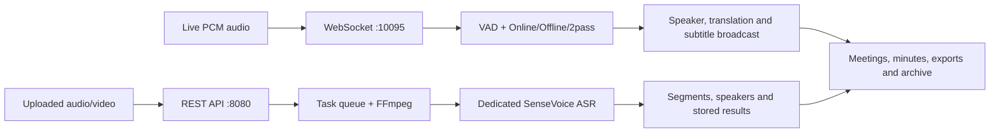

# Magic Box AI (WYL ASR)

[中文](README.md) · [English](README_EN.md)

Magic Box AI is a local speech-content processing service built on FunASR. It provides real-time WebSocket transcription, uploaded audio/video recognition, and supporting meeting, speaker, hotword, subtitle, and document features.

The project consists of a Python backend, a Vue 3 management UI, and optional .NET subtitle clients. The backend starts the WebSocket server and Flask REST API in the same process. The UI runs through Vite in development or is built as static files and served by the backend in the Docker image.

> Models, runtime data, uploaded media, and build outputs are not versioned. The service loads local model directories only, so prepare models before the first run.

## Scope

| Use case | Current implementation |
| --- | --- |
| Real-time transcription | Receives binary PCM audio through `ws://<host>:10095/` and returns online, offline, and 2pass recognition results. |
| File recognition | Uploads audio or video through REST APIs and processes conversion, recognition, segmentation, speaker handling, and result lookup as background tasks. |
| Meeting data | Stores meetings, audio, transcripts, translations, minutes versions, and related documents. |
| Speakers and hotwords | Provides APIs for speaker registration, identification, uploaded-segment correction, and hotword management. |
| Subtitles | The web UI configures subtitles; `VoiceRecognitionDisplay/` and `subtitle_display/` contain .NET client projects. |
| Local-service integration | Includes LLM/minutes task APIs, health checks, CORS, API-key, serial-port, and SSL configuration entry points. |

## Services and default ports

| Service | Default address | Code entry point |
| --- | --- | --- |
| WebSocket transcription | `ws://127.0.0.1:10095/` | `main.py`, `src/modules/network/websocket_service.py` |
| REST API | `http://127.0.0.1:8080/api` | `src/modules/database/database_api.py` |
| Health check | `http://127.0.0.1:8080/api/health` | `GET /api/health` |
| Web UI (development) | `http://127.0.0.1:5173` | `ui/` |

Default frontend endpoints are defined in `ui/src/config/api.ts`. When opened from a remote host, the UI uses the browser's current hostname while retaining ports `10095` and `8080`.

## Requirements

- Python 3.8 or newer (the Docker image uses Python 3.11).
- Node.js and npm for the web UI; Docker builds with Node.js 20.
- `ffmpeg` for uploaded-media conversion and audio extraction. If `tools/bin/ffmpeg` exists, `start.sh` uses it first.
- Optional: .NET 8 SDK for subtitle clients.
- Local FunASR models. Models are not downloaded when the service starts.

## Quick start

Run the following from the project root.

### 1. Create a Python environment and install dependencies

```bash
python3 -m venv .venv
. .venv/bin/activate
python -m pip install --upgrade pip
pip install -r requirements.txt
```

### 2. Install web UI dependencies

```bash
cd ui
npm ci
cd ..
```

### 3. Download and organize base models

`organize_models.py` downloads base models through ModelScope and places them under `models/`. Model files are large and intentionally excluded from Git.

```bash
python organize_models.py
```

Before the first start, confirm that `models/SenseVoiceSmall` is available. If uploaded-file recognition uses built-in diarization, also provide its configured VAD, CAM++, and punctuation models.

### 4. Start the services

```bash
./start.sh start
```

By default this starts both the backend and the Vite UI. The script checks for `curl`, `nc`, Python, and frontend dependencies, then stores PIDs and logs in `.runtime/wyl-asr/`.

```bash
./start.sh status
./start.sh logs backend
./start.sh logs ui
./start.sh stop
```

Verify the REST API:

```bash
curl http://127.0.0.1:8080/api/health
```

### Recommended first start

`WYL_ASR_ENABLE_2PASS` defaults to `auto`. If its configured online Paraformer directory is unavailable, `start.sh` starts with `--disable_2pass`. To explicitly run offline/upload recognition only:

```bash
WYL_ASR_ENABLE_2PASS=0 ./start.sh start
```

To enable 2pass, point `WYL_ASR_ONLINE_ASR_MODEL` to a prepared, compatible local online model directory.

## Configuration

`start.sh` reads environment variables and automatically loads `.env.local` from the project root. Do not commit that file. Common settings are listed below.

| Variable | Default | Description |
| --- | --- | --- |
| `WYL_ASR_HOST` | `0.0.0.0` | WebSocket and API bind address. |
| `WYL_ASR_WS_PORT` | `10095` | WebSocket port. |
| `WYL_ASR_API_PORT` | `8080` | REST API port. |
| `WYL_ASR_ENABLE_UI` | `1` | Set to `0` to skip the Vite UI. |
| `WYL_ASR_UI_HOST` / `WYL_ASR_UI_PORT` | `127.0.0.1` / `5173` | Vite development-server address. |
| `WYL_ASR_MODEL_DEVICE` | `auto` | `auto`, `cpu`, `cuda`, or `mps`; `auto` prefers CUDA, then MPS. |
| `WYL_ASR_NGPU` / `WYL_ASR_NCPU` | automatic / `4` | GPU and CPU values passed to FunASR. |
| `WYL_ASR_ASR_MODEL` | `models/SenseVoiceSmall` | Local offline ASR model directory for real-time transcription. |
| `WYL_ASR_UPLOAD_ASR_MODEL` | same as ASR model | Dedicated local ASR model directory for uploaded files. |
| `WYL_ASR_ENABLE_2PASS` | `auto` | `auto`, `1`, or `0`. |
| `WYL_ASR_ONLINE_ASR_MODEL` | Paraformer path from the script | Local online model directory for 2pass. |
| `WYL_ASR_ENABLE_SERIAL` | `0` | Set to `1` to enable serial input. |
| `WYL_ASR_SERIAL_PORT` / `WYL_ASR_SERIAL_BAUDRATE` | empty / `9600` | Serial device and baud rate. |
| `WYL_ASR_UPLOAD_ASR_LANGUAGE` | `zh` | Uploaded-file language: `auto`, `zh`, `en`, `yue`, `ja`, `ko`, or `nospeech`. |

Example: run the backend on CPU with 2pass and the web UI disabled.

```bash
WYL_ASR_MODEL_DEVICE=cpu \
WYL_ASR_ENABLE_2PASS=0 \
WYL_ASR_ENABLE_UI=0 \
./start.sh start
```

## API overview

All application APIs are under `/api`. For exact request and response schemas, refer to `src/modules/database/database_api.py` and the frontend calls.

| Group | Representative endpoints | Purpose |
| --- | --- | --- |
| Health | `GET /api/health` | Checks database, segmentation service, and task queues. |
| Upload recognition | `POST /api/upload/audio/recognize`, `GET /api/upload/audio/tasks/<task_id>` | Creates and retrieves uploaded audio/video recognition tasks. |
| Upload correction | `/api/upload/audio/tasks/<task_id>/corrections`, `/speakers/*` | Corrects speakers and segments in uploaded results. |
| Meetings | `/api/meetings`, `/api/meetings/<id>/speech-results` | Manages meetings, recordings, and transcript data. |
| Minutes and documents | `/api/meetings/<id>/minutes`, `/api/summary/tasks` | Stores minutes, versions, documents, and asynchronous minutes tasks. |
| Speakers | `/api/speakers/register`, `/api/speakers/list`, `/api/speakers/identify` | Registers, lists, and identifies speakers. |
| Hotwords | `/api/hotwords`, `/api/hotwords/import` | Manages and imports hotwords. |
| LLM | `/api/llm/config`, `/api/llm/chat`, `/api/llm/tasks` | Manages local LLM settings and tasks. |

The upload API accepts: `wav`, `mp3`, `flac`, `m4a`, `aac`, `ogg`, `webm`, `mp4`, `mov`, `mkv`, `avi`, `wmv`, `m4v`, `amr`, `opus`, and `wma`. Flask accepts requests up to 2 GB.

### API access control and CORS

- When `WYL_ASR_API_KEY` is set, every `/api/*` request must include `X-API-Key` or `Authorization: Bearer <key>`.
- `WYL_ASR_CORS_ORIGINS` is a comma-separated list of allowed origins. Its default is `*`; production deployments should use explicit frontend origins.
- Configure HTTPS/WSS through `--certfile` and `--keyfile` arguments to `main.py`.

## Docker

The Dockerfile builds the Vue UI and serves its static files from the REST application in the final Python image. The default image command disables 2pass and serial input and expects local models under `/app/models`.

```bash
docker build -t magic-box-ai .

docker run --rm \
  -p 10095:10095 \
  -p 8080:8080 \
  -v "$PWD/models:/app/models:ro" \
  -v "$PWD/data:/app/data" \
  magic-box-ai
```

Ensure that the mounted `models/` directory contains the model paths referenced by the Dockerfile before starting the container.

## Optional subtitle clients

- `VoiceRecognitionDisplay/VoiceRecognitionDisplay.sln`: cross-platform subtitle client solution with Desktop, Android, iOS, macOS, Linux, and test projects.
- `subtitle_display/`: a lightweight scrolling subtitle client.

Both use .NET 8. For the lightweight client:

```bash
cd subtitle_display
dotnet restore
dotnet run
```

## Project layout

```text
.
├── main.py                         # Process entry point for WebSocket and Flask API
├── start.sh                        # Local start, stop, log, and status commands
├── organize_models.py              # ModelScope download and organization tool
├── requirements.txt                # Python dependencies
├── src/modules/
│   ├── audio/                      # Audio processing, conversion, and VAD
│   ├── config/                     # Arguments, logging, and SSL
│   ├── core/                       # Service state and model loading
│   ├── database/                   # Flask API, SQLite data, and upload tasks
│   ├── network/                    # WebSocket and translation services
│   ├── serial/                     # Serial input
│   └── speaker/                    # Speaker identification, labeling, and voiceprints
├── ui/                             # Vue 3 + Vite management UI
├── VoiceRecognitionDisplay/        # .NET cross-platform subtitle clients
├── subtitle_display/               # .NET lightweight scrolling subtitle client
├── tests/                          # Python tests
└── Dockerfile                      # Multi-stage frontend/backend container build
```

## Recognition architecture

Magic Box AI has two first-class recognition paths. They share meeting storage, hotwords, speakers, translation, minutes, export, and archival features, but use different protocols, model instances, parameters, and lifecycles.

| Path | Input and protocol | Recognition path | Result lifecycle |
| --- | --- | --- | --- |
| Real-time transcription | Microphone/device PCM sent over a persistent WebSocket connection | Online ASR, offline ASR, or 2pass; connection-level state is kept in memory | Interim and final results are pushed continuously until the connection ends. |
| Uploaded media recognition | Audio/video submitted through REST | The dedicated `model_asr_upload` instance, normally SenseVoiceSmall | A persisted background task moves through `queued`, `running`, `succeeded`, `failed`, or `cancelled`. |

Uploaded-media recognition is not a file-input mode of the real-time service and does not reuse `2pass-offline` state.



### Functional coverage

- Voice processing: VAD, punctuation restoration, multi-language recognition, local Chinese/English translation, and hotwords.
- Speaker processing: registration, real-time voiceprint identification, uploaded-file diarization, optional voiceprint matching, auditioning, rename, merge, and corrections.
- Meeting work: multiple minutes templates, long-text segmentation, minutes versions, source media, transcripts, emotion analysis, and related document archive.
- Delivery: Word/PDF export, source-media download and sharing, web management, desktop/mobile subtitle clients, health checks, API keys, TLS, and Docker deployment.

### Subtitle clients

| Client | Platforms | Typical use | Available capabilities |
| --- | --- | --- | --- |
| Floating desktop subtitles | Windows, macOS, Linux | Meetings, presentations, desktop accessibility | Live connection, borderless always-on-top window, dragging, saved position, bilingual/speaker text, and style settings. |
| Android overlay subtitles | Android | Mobile meetings and display overlay | Overlay permission, foreground service, persistent display, live connection, and subtitle settings. |
| iOS subtitle client | iOS | Mobile live captions | `net8.0-ios` project, live WebSocket captions, bilingual and speaker display. |
| Lightweight scrolling subtitles | Windows, macOS, Linux | Large screens, second displays, streaming, OBS | Manual connection, speaker prefixes, accumulation by speaker, automatic wrapping/scrolling, clear, and always-on-top. |

All subtitle clients consume live and 2pass results through WebSocket. Settings saved in the web UI can be broadcast to connected clients; clients also persist their endpoint, appearance, and window settings locally.

## Model management

The service uses local FunASR model directories. Common model roles are offline ASR, online ASR for 2pass, VAD, punctuation, CAM++/other speaker models, and OPUS-MT translation models. The exact paths are selected by startup arguments and environment variables.

```bash
# Download and organise the base local models
python organize_models.py

# Check models when the test utility and models are available
python tests/check_models.py

# Choose an execution device
WYL_ASR_MODEL_DEVICE=cuda ./start.sh start
WYL_ASR_MODEL_DEVICE=cpu WYL_ASR_NCPU=8 ./start.sh start
WYL_ASR_MODEL_DEVICE=auto ./start.sh start
```

The uploaded-media pipeline uses its own `model_asr_upload`, configured by `WYL_ASR_UPLOAD_ASR_MODEL`. It defaults to the same local SenseVoiceSmall directory as the primary ASR model, but it is loaded and invoked independently.

## Command-line settings

`main.py` accepts startup options in addition to the environment variables shown above.

| Option | Default | Purpose |
| --- | --- | --- |
| `--host` | `0.0.0.0` | Bind address. |
| `--port` / `--api-port` | `10095` / `8080` | WebSocket and REST API ports. |
| `--device` | `cpu` | `cuda`, `cpu`, or `mps`; `start.sh` can select automatically with `WYL_ASR_MODEL_DEVICE=auto`. |
| `--ngpu` / `--ncpu` | `0` / `4` | GPU count and CPU worker setting passed to FunASR. |
| `--certfile` / `--keyfile` | `ssl_key/server.crt` / `ssl_key/server.key` | TLS certificate and private-key paths. |
| `--enable_speaker_verification` | enabled | Enables voiceprint verification and registered-speaker identification. |
| `--speaker_threshold` | `0.4` | Speaker-match threshold. |
| `--enable_2pass` / `--disable_2pass` | enabled | Controls the online model used by 2pass. |
| `--upload_asr_model` | SenseVoiceSmall | Dedicated ASR model for uploaded media. |
| `--upload_asr_language` | `zh` | Default language for uploaded-media recognition. |
| `--upload_asr_enable_internal_speaker` | enabled | Uses FunASR's built-in speaker-model output for uploaded media. |
| `--upload_asr_spk_mode` | `vad_segment` | Speaker-output allocation mode; the default preserves speaker boundaries. |

CLI options override environment defaults. `start.sh` also reads `.env.local` from the repository root when present.

## Speaker identification

Start normally to load the real-time CAM++ verification model, or tune the threshold directly while debugging:

```bash
./start.sh start
python main.py --enable_speaker_verification --speaker_threshold 0.4
```

In a real-time recognition result, speaker fields are returned when identification is enabled:

```json
{
  "type": "recognition",
  "text": "Hello, this is a test speech.",
  "speaker_name": "user001",
  "speaker_type": "registered",
  "speaker_confidence": 0.85,
  "timestamp": "2025-01-01T12:00:00Z"
}
```

The uploaded-media result additionally exposes `segments`, `speaker_result`, `speaker-candidates`, and `registration_audio`. The UI can audition candidate segments, rename or merge temporary speakers, and use a selected segment to register a voiceprint.

## Translation

Translation is provided by `src/modules/network/local_translation.py`. If a local OPUS-MT model has been prepared, both real-time 2pass output and uploaded-media output can include a translation. If the model is absent or cannot load, the translation field is empty and ASR text continues to work.

Enable it in an initial WebSocket message:

```json
{
  "type": "init",
  "mode": "2pass",
  "language": "zh",
  "enable_translation": true
}
```

Recognition messages then include a `translation` field alongside `text`. To prepare the optional local translation model, see `scripts/download_opus_mt.py`.

## Uploaded audio/video recognition

Uploaded recognition processes existing recordings, meeting videos, and archived media in a background task. It stores the source file, progress, stage, result, and error details. The pipeline is designed for whole-file recognition rather than an application-level 8 MB chunking loop.

1. Save the upload and create an `uploaded_audio_tasks` record.
2. Inspect media with `ffprobe` and convert it to 16 kHz mono WAV using FFmpeg.
3. Run whole-file ASR through the independent upload model.
4. Prefer FunASR `sentence_info` speaker and timestamp output for display segments.
5. When necessary, produce fallback segments with VAD, CAM++ embeddings, and targeted re-recognition.
6. Optionally compare quality speaker samples with the registered voiceprint library.
7. Translate/clean the text and persist full text, segments, and metadata.
8. Let the user audition, correct, merge, generate minutes, and save the result as a meeting.

| Stage | Typical progress | Meaning |
| --- | --- | --- |
| `queued` | 0% | The task is waiting for a background worker. |
| Preparing media | 2–15% | Source save, probing, and recognition-WAV conversion. |
| ASR | 15–75% | Whole-file recognition by the upload model. |
| Speaker processing | 80–88% | Speaker segments/candidates and optional voiceprint matching. |
| Translation and cleanup | 88–96% | Translation and text post-processing. |
| `succeeded` | 100% | Full text and segments are ready. |

Tasks may instead end as `failed` or `cancelled`; a cancelled task never becomes an accepted transcript.

### Media conversion and storage

`src/modules/audio/audio_format_handler.py` resolves FFmpeg in this order: `FFMPEG_BINARY` / `WYL_ASR_FFMPEG_BINARY`, the bundled `tools/bin/ffmpeg`, then the system `PATH`. It uses `ffprobe` first and can fall back to parsing `ffmpeg -i` output.

| Item | Value |
| --- | --- |
| Source uploads | `data/audio/uploads/` |
| Recognition WAV files | `data/audio/uploads/recognition/` |
| Conversion output | 16 kHz, mono WAV |
| Default maximum upload | `UPLOAD_ASR_MAX_AUDIO_MB=2048` (2 GB) |
| Accepted media | `wav`, `mp3`, `flac`, `m4a`, `aac`, `ogg`, `webm`, `mp4`, `mov`, `mkv`, `avi`, `wmv`, `m4v`, `amr`, `opus`, `wma` |

`segments` are result/display units for editing, auditioning, and registration; they do not mean the original upload was split into independent primary ASR jobs. A whole-file result reports:

```json
{ "chunked": false, "chunk_count": 1 }
```

### Upload REST API

```http
POST /api/upload/audio/recognize
Content-Type: multipart/form-data
```

| Form field | Required | Default | Meaning |
| --- | --- | --- |
| `file` | Yes | — | Audio or video file. |
| `language` | No | `zh` | `zh`, `auto`, `en`, `yue`, `ja`, `ko`, and other model-supported values. |
| `async_task` | No | `false` | Return a task ID immediately. The UI normally uses asynchronous tasks. |
| `enable_speaker_diarization` | No | `true` | Enable diarization and voiceprint matching for the upload. |
| `enable_translation` | No | `false` | Enable local translation. |
| `speaker_top_k` | No | `3` | Number of voiceprint candidates. |
| `expected_speakers` | No | empty | Fixed speaker count. |
| `min_speakers` / `max_speakers` | No | empty | Speaker-count range, for example `2` and `4`. |
| `hotwords` | No | empty | Upload-specific hotwords. |

```bash
curl -X POST http://127.0.0.1:8080/api/upload/audio/recognize \
  -F "file=@meeting.wav" \
  -F "language=zh" \
  -F "enable_speaker_diarization=true" \
  -F "enable_translation=true" \
  -F "async_task=true" \
  -F "min_speakers=2" \
  -F "max_speakers=4"

curl http://127.0.0.1:8080/api/upload/audio/tasks/<task_id>
```

Related task endpoints include creation, status lookup, source-media retrieval, temporary segment audio, candidate speakers, speaker rename/merge, and text corrections. The frontend polls a pending task every 1.5 seconds and loads its `segments` once completed.

### Upload-specific configuration

| Variable | Default | Purpose |
| --- | --- | --- |
| `UPLOAD_ASR_MAX_AUDIO_MB` | `2048` | Maximum uploaded-media size. |
| `UPLOAD_ASR_TASK_MAX_WORKERS` | `1` | Concurrent upload-recognition workers. |
| `WYL_ASR_UPLOAD_ASR_MODEL` | `WYL_ASR_ASR_MODEL` | Dedicated upload ASR model. |
| `WYL_ASR_UPLOAD_ASR_VAD_MODEL` | local FSMN VAD path | VAD model used for uploaded-media speaker work. |
| `WYL_ASR_UPLOAD_ASR_SPK_MODEL` | local CAM++ path | Speaker model for the built-in upload path. |
| `WYL_ASR_UPLOAD_ASR_PUNC_MODEL` | local CT-Punc path or `ct-punc` | Punctuation model for uploaded-media speaker output. |
| `WYL_ASR_UPLOAD_ASR_BATCH_SIZE_S` | `60` | Dynamic upload batch duration in seconds. |
| `WYL_ASR_UPLOAD_ASR_MERGE_VAD` | `0` | Merge internal VAD segments; off preserves speaker boundaries. |
| `WYL_ASR_UPLOAD_ASR_LANGUAGE` | `zh` | Uploaded-media language. |
| `UPLOAD_ASR_ENABLE_DISFLUENCY_CLEANUP` | `true` | Clean obvious filler-only and repeated phrases. |
| `UPLOAD_VOICEPRINT_MATCH_SAMPLES` | `8` | Maximum samples selected per temporary speaker for matching. |

## WebSocket protocol

Connect to `ws://<host>:10095/`, send an initial JSON configuration message, then send binary PCM audio chunks. A representative setup message is:

```json
{
  "type": "init",
  "mode": "online",
  "language": "zh",
  "sample_rate": 16000,
  "chunk_size": [5, 10, 5],
  "vad_threshold": 0.3,
  "enable_vad": true,
  "enable_translation": false,
  "enable_speaker_identification": true,
  "speaker_top_k": 3,
  "hotwords": "hotword1,hotword2",
  "audio_capture_mode": "browser"
}
```

Result messages contain text, optional translation and speaker details, a timestamp, confidence, and `is_final`. Use `online` for low latency, `offline` for complete segments, and `2pass` to combine streaming feedback with an offline correction pass. `uploaded-sensevoice` is a REST task mode, not a WebSocket-session mode.

## Docker Compose example

The Docker section above is sufficient for a single container. For a Compose deployment, create a `docker-compose.yml` suited to your environment, mount models read-only where appropriate, persist `data/` and `logs/`, expose ports `10095` and `8080`, and pass a command that selects existing local model paths. The repository deliberately does not ship a fixed Compose file, so deployments can choose CPU/GPU settings and storage locations explicitly.

## Testing

Install development dependencies, then run the available test suite:

```bash
pip install -r requirements-dev.txt
python -m pytest tests/ -v

# A focused WebSocket check
python -m pytest tests/test_websocket.py -v

# Upload validation and task-protection checks
python -m pytest tests/test_uploaded_audio_protection.py -v
```

Some tests depend on local models, audio hardware, or media fixtures. Relevant coverage includes WebSocket connection handling, VAD configuration, audio processing, device/microphone access, concurrency, speaker functions, hotwords, model loading, database APIs, upload-task protections, meeting workflow safeguards, and meeting emotion analysis.

## Operation and troubleshooting

### Recognition and VAD

- `vad_threshold` ranges from `0.0` to `1.0`; lower values are more sensitive. Typical starting points are `0.3` in quiet rooms and `0.5–0.8` in noisy rooms.
- Use `WYL_ASR_MODEL_DEVICE=auto` for CUDA/MPS/CPU selection, or explicitly select `cuda`/`cpu` and tune `WYL_ASR_NGPU`/`WYL_ASR_NCPU`.
- `WYL_ASR_ENABLE_2PASS=auto` enables 2pass only when the configured local online model exists. Offline and uploaded-media recognition remain available when it is disabled.

### Upload problems

- Many displayed `segments` with `chunked=false` is expected: they are presentation and speaker units, not independent whole-file ASR jobs.
- An empty translation normally means the local OPUS-MT model is missing or failed to load; ASR output is unaffected.
- Video uploads require FFmpeg to extract the audio track. Check it with `tools/bin/ffmpeg -hide_banner -i input.mp4` or `ffmpeg -hide_banner -i input.mp4`.
- If the bundled FFmpeg cannot run, set `FFMPEG_BINARY=/path/to/ffmpeg` and restart the service.

### Service problems

```bash
# Reorganise missing/incomplete model files
python organize_models.py

# Move real-time processing to CPU if GPU memory is exhausted
WYL_ASR_MODEL_DEVICE=cpu ./start.sh restart

# Inspect port use and service logs
lsof -i :10095
./start.sh logs backend
```

When an API key is configured, supply it as `X-API-Key` or `Authorization: Bearer <key>`. In production, set explicit `WYL_ASR_CORS_ORIGINS` rather than leaving the development default of `*`.

## Documentation and frontend

- [Chinese feature guide](功能说明书.md) describes the dual recognition paths, system architecture, client capabilities, and meeting artifacts.
- [Chinese operation guide](操作说明书.md) covers real-time transcription, uploaded recognition, meeting minutes, and client operations.
- [Contributing guide](CONTRIBUTING.md) explains contribution expectations.

The Vue 3 + TypeScript UI is in `ui/`. It supports live transcription, async upload progress, speaker organization, meetings and media timelines, minutes versions, emotion-analysis artifacts, hotword management, Word/PDF exports, sharing, and responsive Element Plus views.

```bash
cd ui
npm ci
npm run dev
npm run build
```

For development, `ui/.env.development` can set `VITE_API_BASE_URL` and `VITE_WS_BASE_URL`. The Docker build produces `ui/dist/`, which the API serves on port `8080`.

## Acknowledgements

- [FunASR](https://github.com/alibaba-damo-academy/FunASR)
- [ModelScope](https://modelscope.cn/)
- [WebSockets](https://websockets.readthedocs.io/)
- [PyTorch](https://pytorch.org/)
- [NumPy](https://numpy.org/)
- [SoundFile](https://pysoundfile.readthedocs.io/)
- [Librosa](https://librosa.org/doc/latest/index.html)
- [FFmpeg](https://ffmpeg.org/)

## Development checks

```bash
# Python tests; model-dependent tests may require local models and audio hardware
pytest

# Frontend type check and production build
cd ui
npm run build

# Optional .NET subtitle-client tests
dotnet test VoiceRecognitionDisplay/VoiceRecognitionDisplay.sln
```

## License

This project is released under the [MIT License](LICENSE).
