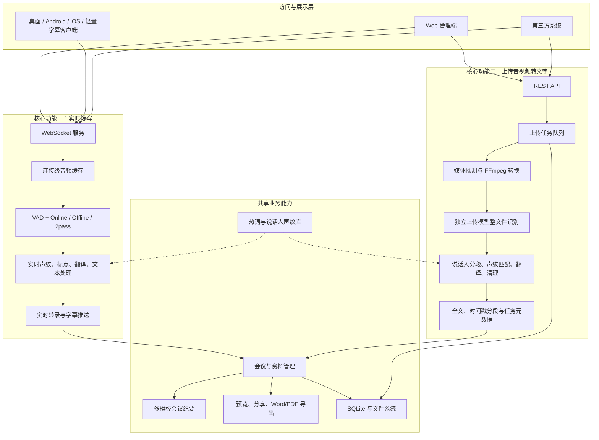
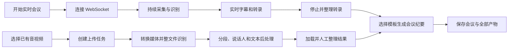
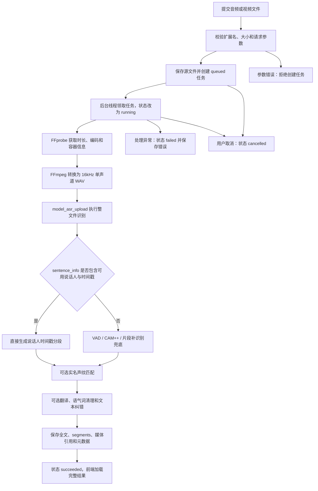

# WYL ASR 功能说明书

**文档版本**：V1.3
**编写日期**：2026-06-24
**项目名称**：WYL ASR 实时转写与上传音视频转文字平台

---

## 目录

1. [系统概述](#1-系统概述)
2. [系统架构](#2-系统架构)
3. [核心功能模块](#3-核心功能模块)
   - 3.1 [语音活动检测（VAD）](#31-语音活动检测vad)
   - 3.2 [实时转写（ASR）](#32-实时转写asr)
   - 3.3 [说话人识别与分离](#33-说话人识别与分离)
   - 3.4 [标点符号恢复](#34-标点符号恢复)
   - 3.5 [识别结果翻译](#35-识别结果翻译)
   - 3.6 [热词管理](#36-热词管理)
   - 3.7 [WebSocket 服务](#37-websocket-服务)
   - 3.8 [RESTful API 服务](#38-restful-api-服务)
   - 3.9 [上传音视频转文字](#39-上传音视频转文字)
   - 3.10 [文本处理与文档分段](#310-文本处理与文档分段)
   - 3.11 [运行统计与健康监测](#311-运行统计与健康监测)
4. [数据存储功能](#4-数据存储功能)
   - 4.1 [会议管理](#41-会议管理)
   - 4.2 [语音文件存储](#42-语音文件存储)
   - 4.3 [转录文本存储](#43-转录文本存储)
   - 4.4 [会议纪要生成](#44-会议纪要生成)
   - 4.5 [会议资料与分析文档](#45-会议资料与分析文档)
5. [Web 前端与客户端功能](#5-web-前端与客户端功能)
6. [模型管理功能](#6-模型管理功能)
7. [安全与权限功能](#7-安全与权限功能)
8. [第三方接口对接](#8-第三方接口对接)
9. [部署与运维功能](#9-部署与运维功能)
10. [功能状态总览](#10-功能状态总览)

---

## 1. 系统概述

WYL ASR 是一套基于阿里达摩院 **FunASR** 框架构建的语音内容处理平台，以“实时转写”和“上传音视频转文字”为两大核心功能，并配套说话人处理、翻译、热词、会议纪要、会议资料管理、文档导出和多端字幕展示能力。

两大核心功能在产品入口上并列，在技术链路上相互独立：

| 核心功能 | 功能定义 | 输入 | 输出方式 |
|----------|----------|------|----------|
| 实时转写 | 对正在发生的语音持续识别，边说边显示，并可使用 2pass 校正 | 麦克风、服务器音频设备、实时 PCM 流 | WebSocket 持续推送中间结果和最终句段 |
| 上传音视频转文字 | 对已有音频或视频执行后台离线转写，形成完整可归档成果 | 本地音频或视频文件 | REST 创建任务，前端轮询进度，完成后读取整份结果 |

两条链路共用热词、声纹库、翻译、会议纪要和会议管理，但不共用连接缓存、任务状态和识别参数。上传音视频转文字不是实时转写的附件功能，也不复用实时 `2pass-offline` 缓存。

### 适用场景

| 场景 | 说明 |
|------|------|
| 实时会议转写 | 多人会议实时语音转文字，自动区分发言人并同步字幕 |
| 上传音视频转文字 | 上传已有录音或视频，后台转换为完整转录稿并生成会议产物 |
| 会议纪要生成 | 基于转录内容由 AI 自动生成结构化会议纪要 |
| 语音内容归档 | 音频文件与转录文本的持久化存储与管理 |
| 跨语言沟通 | 中英文实时互译，支持多语言识别 |
| 系统集成 | 通过标准 API 与第三方平台对接 |

### 技术栈

| 层次 | 技术 |
|------|------|
| AI 引擎 | FunASR（阿里达摩院）、SenseVoice、Paraformer |
| 后端服务 | Python 3.8+、asyncio、WebSocket、Flask |
| 前端界面 | Vue 3 + TypeScript + Element Plus |
| 数据存储 | SQLite |
| 通信协议 | WebSocket（ws/wss）、HTTP/HTTPS RESTful |
| 部署方式 | 原生 Python / Docker 容器 |

---

## 2. 系统架构

### 2.1 总体逻辑架构



### 2.2 两条核心链路边界

| 架构项 | 实时转写链路 | 上传音视频转文字链路 |
|--------|--------------|----------------------|
| 接入协议 | WebSocket | HTTP/HTTPS REST |
| 生命周期 | 一个实时连接和一次录音会话 | 一个持久化 `task_id` |
| 处理方式 | 连续接收音频块，按端点逐段识别 | 保存完整源文件后执行整文件识别 |
| 模型资源 | Online / Offline / 2pass 实时模型 | 独立 `model_asr_upload` |
| 状态管理 | 连接、录音、识别、停止 | 排队、运行、成功、失败、取消 |
| 结果返回 | 持续推送，允许中间结果被最终结果替换 | 轮询阶段和进度，成功后一次加载完整结果 |
| 数据保存 | 停止后保存录音和转录 | 从任务创建起保存源媒体、状态、结果和错误 |
| 失败影响 | 影响当前连接或当前句段 | 仅影响对应任务，不污染实时连接缓存 |

### 2.3 双核心业务流程



### 2.4 上传任务处理架构



---

## 3. 核心功能模块

### 3.1 语音活动检测（VAD）

**功能描述**：自动检测音频流中的语音片段，过滤静音和噪声，提升识别效率。

**技术实现**：使用 `FSMN-VAD`（`speech_fsmn_vad_zh-cn-16k-common-pytorch`）模型。

**主要能力**：

- 实时检测语音起止端点
- 可配置灵敏度阈值（`vad_threshold`，范围 0.0 ~ 1.0）
- 安静环境推荐阈值：0.3；嘈杂环境推荐：0.5 ~ 0.8
- 支持与 ASR 识别流水线无缝衔接

**关键参数**：

| 参数 | 默认值 | 说明 |
|------|--------|------|
| `vad_threshold` | 0.3 | VAD 检测灵敏度阈值 |
| `enable_vad` | true | 是否启用 VAD 检测 |

---

### 3.2 实时转写（ASR）

**功能描述**：通过 WebSocket 持续接收实时音频流，将正在发生的语音转换为文字。支持在线流式、离线句段和双通道混合模式，重点满足低延迟显示和会后准确文本兼顾的场景。

#### 3.2.1 识别模式

| 模式 | 标识 | 说明 | 适用场景 |
|------|------|------|----------|
| 在线流式识别 | `online` | 低延迟，毫秒级返回中间结果 | 实时交互对话 |
| 离线高精度识别 | `offline` | 高准确率，识别完整语音段后输出 | 会议转录、内容归档 |
| 双通道模式 | `2pass` | 在线+离线结合，先出流式结果再校正 | 兼顾实时性与精度 |

#### 3.2.2 支持模型

| 模型名称 | 类型 | 特点 |
|----------|------|------|
| `SenseVoiceSmall` | 离线 | 多语言、情感检测、高精度 |
| `Paraformer-Large (Online)` | 在线 | 流式低延迟 |
| `Paraformer-Large (Offline)` | 离线 | 高精度批量识别 |

#### 3.2.3 音频规格

| 项目 | 规格 |
|------|------|
| 采样率 | 16 kHz |
| 位深 | 16 bit |
| 声道 | 单声道（PCM） |
| 传输协议 | WebSocket 二进制子协议 |

#### 3.2.4 实时结果特征

- 持续输出中间识别结果，界面可即时刷新
- 语音端点结束后输出最终句段
- 2pass 模式可用离线结果替换或校正在线文本
- 可附带说话人、时间、译文和置信度信息
- 停止录音后可继续修改转录、生成会议纪要并保存会议

#### 3.2.5 多语言支持

- 主要支持：中文（普通话）、英文
- 可扩展至其他语种（依赖模型支持）

---

### 3.3 说话人识别与分离

**功能描述**：在多人对话场景下，自动识别和标注不同发言人身份，并支持前端开关统一控制。

**技术实现**：使用 `CAM++` / `3D-Speaker` 说话人识别模型。

#### 功能细项

| 子功能 | 说明 |
|--------|------|
| 说话人注册 | 录入指定人员的声纹特征，存入说话人数据库 |
| 实时识别 | 在转录文字前标注对应说话人 ID |
| 置信度输出 | 每次识别附带相似度分值（`speaker_confidence`） |
| 前端开关控制 | 支持在 Web 界面实时开关说话人功能 |
| 阈值配置 | `speaker_threshold` 可调（默认 0.6） |

#### 识别结果格式示例

```json
{
  "text": "今天会议的主要议题是...",
  "speaker_id": "user001",
  "speaker_confidence": 0.85,
  "timestamp": "2026-05-25T08:00:00Z"
}
```

---

### 3.4 标点符号恢复

**功能描述**：对 ASR 输出的纯文字内容自动添加标点符号，提升文本可读性。

**技术实现**：使用 `CT-Transformer`（`punc_ct-transformer_zh-cn-common-vad_realtime-vocab272727`）标点恢复模型。

**主要能力**：
- 自动为识别结果添加逗号、句号、问号等标点
- 实时模式与离线模式均支持
- 显著提升转录文本的可读性和会议纪要质量

---

### 3.5 识别结果翻译

**功能描述**：支持中英文双向翻译，实时转写可同步输出译文，上传音视频转文字可在任务后处理阶段生成整段和分段译文。

> ⚠️ **注意**：翻译模型体积约 4GB，翻译延迟较高，建议在非实时场景下使用。

**主要能力**：
- 识别结果自动附带翻译文本
- 支持中→英、英→中翻译
- 实时译文随识别结果通过 WebSocket 返回
- 上传译文保存在任务全文和 `segments` 分段中

**翻译结果格式示例**：

```json
{
  "text": "你好，这是一段测试语音",
  "translation": "Hello, this is a test speech",
  "language": "zh-cn"
}
```

---

### 3.6 热词管理

**功能描述**：支持动态配置识别热词，提升特定词汇（如人名、产品名、专业术语）的识别准确率。

#### 功能细项

| 操作 | 说明 |
|------|------|
| 热词维护 | 添加、修改、删除热词并设置 1~100 权重 |
| 资产属性 | 记录分类、来源、保护状态和说明 |
| 检索筛选 | 按关键词、分类、来源、保护状态和权重范围筛选 |
| 保护机制 | 受保护热词不可直接删除；批量清空时保留保护词 |
| 批量导入 | 支持 TXT、CSV、JSON，支持合并或替换未保护词 |
| 批量导出 | 导出识别用 TXT 或包含属性的资产 JSON |
| 预设热词 | 从内置行业和常用词预设快速添加 |
| 识别应用 | 实时识别可加载热词，上传识别可选择热词分类范围 |

**配置方式**（WebSocket 初始化消息）：

```json
{
  "type": "init",
  "hotwords": "张三,李四,产品名称A"
}
```

---

### 3.7 WebSocket 服务

**功能描述**：核心音频传输与识别结果推送通道，使用 WebSocket 二进制协议实现低延迟双向通信。

**服务地址**：`ws://host:10095`（或 `wss://` SSL 模式）

#### 通信流程

```
客户端连接 → 发送初始化配置（JSON）→ 持续发送音频数据（二进制）
→ 接收实时识别结果（JSON）→ 发送结束信号 → 断开连接
```

#### 消息格式

**初始化配置消息**：

```json
{
  "type": "init",
  "mode": "2pass",
  "language": "zh",
  "sample_rate": 16000,
  "chunk_size": 1600,
  "vad_threshold": 0.3,
  "enable_vad": true,
  "hotwords": "热词1,热词2"
}
```

**识别结果消息**：

```json
{
  "type": "result",
  "mode": "online",
  "text": "识别的文本内容",
  "is_final": false,
  "timestamp": 1234567890,
  "confidence": 0.95
}
```

**支持的识别模式参数**：

| 参数值 | 说明 |
|--------|------|
| `online` | 在线流式模式 |
| `offline` | 离线高精度模式 |
| `2pass` | 双通道混合模式 |

---

### 3.8 RESTful API 服务

**功能描述**：基于 Flask 的 HTTP API 服务，提供数据库操作、会议管理、文件下载等标准接口。

**服务地址**：`http://host:8080`

#### API 端点总览

| 类别 | 方法 | 路径 | 说明 |
|------|------|------|------|
| 健康检查 | GET | `/api/health` | 服务运行状态 |
| 数据库信息 | GET | `/api/database/info` | 数据库基本信息 |
| 会议列表 | GET | `/api/meetings` | 查询会议记录列表 |
| 会议详情 | GET | `/api/meetings/{id}` | 获取单条会议详情 |
| 创建会议 | POST | `/api/meetings` | 新建会议记录 |
| 结束会议 | PUT | `/api/meetings/{id}/end` | 更新会议结束状态 |
| 删除会议 | DELETE | `/api/meetings/{id}` | 删除会议记录 |
| 音频文件 | GET/POST | `/api/meetings/{id}/audio-files` | 查询或关联会议音频 |
| 识别结果 | GET/POST | `/api/meetings/{id}/speech-results` | 保存或查询分段识别结果 |
| 翻译结果 | GET/POST | `/api/meetings/{id}/translations` | 保存或查询翻译结果 |
| 会议纪要 | GET/POST | `/api/meetings/{id}/minutes` | 查询或保存会议纪要 |
| 纪要版本 | GET/POST | `/api/meetings/{id}/minutes/versions`、`minutes/revise` | 查询版本或按要求修订 |
| 会议文档 | GET/POST | `/api/meetings/documents/list`、`save-documents` | 查询和保存会议资料 |
| 情绪分析 | POST | `/api/meetings/{id}/emotion-analysis` | 生成会议情绪分析 |
| 上传识别 | POST | `/api/upload/audio/recognize` | 上传音频或视频并转换为文字 |
| 上传任务 | GET | `/api/upload/audio/tasks/{task_id}` | 查询上传识别任务状态和结果 |
| 说话人管理 | GET/POST | `/api/speakers/*` | 注册、列表、识别和删除说话人 |
| 热词管理 | GET/POST/PUT/DELETE | `/api/hotwords/*` | 热词查询、保存、导入、修改和删除 |
| 串口单元 | GET/POST/PUT/DELETE | `/api/serial/*` | 单元绑定、模式和串口配置 |
| 字幕设置 | GET/POST | `/api/subtitle-settings` | 查询、保存并广播字幕配置 |
| 音频统计 | GET/POST | `/api/audio-stats/*` | 摘要、性能、趋势、报表、最近任务和重置 |
| 文档分段 | POST | `/api/segment/text`、`/api/segment/batch` | 单文档或批量语义分段 |
| LLM 任务 | POST/GET | `/api/llm/tasks/*`、`/api/summary/tasks/*` | 异步大模型和摘要任务 |

#### 统一响应格式

```json
{
  "code": 200,
  "message": "success",
  "data": { }
}
```

#### API 特性

- ✅ RESTful 标准设计
- ✅ 支持 CORS 跨域访问
- ✅ 统一 JSON 响应格式
- ✅ 完善的错误码与错误信息
- ✅ 严格请求参数验证
- ✅ 可选 API Key / Bearer Token 鉴权
- ✅ 主服务启动时自动随之启动

---

### 3.9 上传音视频转文字

**功能定位**：上传音视频转文字是系统的第二大核心功能。它面向“文件已经存在”的离线资料，不要求用户保持页面录音或 WebSocket 长连接。系统接收完整源文件，创建可追踪的后台任务，完成转写后形成可编辑、可归档、可生成会议纪要的正式成果。

#### 3.9.1 适用输入

| 类型 | 格式示例 | 处理方式 |
|------|----------|----------|
| 音频 | `.wav`, `.mp3`, `.flac`, `.m4a`, `.aac`, `.ogg`, `.webm`, `.amr`, `.opus`, `.wma` | 探测编码后转换为统一识别 WAV |
| 视频 | `.mp4`, `.mov`, `.mkv`, `.avi`, `.wmv`, `.m4v` | 通过 FFmpeg 抽取音轨并转换 |

默认最大上传容量由 `UPLOAD_ASR_MAX_AUDIO_MB` 控制，当前默认值为 2048MB。部署方可根据磁盘、网络、模型性能和并发策略调整。

#### 3.9.2 上传前配置

| 配置 | 作用 |
|------|------|
| 识别语言 | 支持 `zh`、`auto`、`en`、`yue`、`ja`、`ko` 等模型可用语言 |
| 预计人数 | 可填写固定人数或最小/最大范围，辅助说话人分离 |
| 热词范围 | 将选中分类的专有名词加入本次识别请求 |
| 说话人分离 | 生成临时说话人及对应时间段 |
| 实名声纹匹配 | 从临时说话人片段中抽取样本，与已注册人员声纹比对 |
| 中英翻译 | 生成整段译文和逐段译文 |
| 异步任务 | 创建任务后立即返回 `task_id`，前端通过轮询展示进度 |

#### 3.9.3 媒体预处理

1. 服务端校验文件扩展名、大小和参数。
2. 保存原始音频或视频，保留原始文件名和媒体信息。
3. 优先使用 ffprobe 获取时长、容器、编码和文件大小。
4. 使用 FFmpeg 将媒体统一转换为 16kHz、单声道 WAV。
5. 生成 `registration_audio` 时间基准，供后续片段试听和声纹注册使用。

视频文件只提取音轨用于识别，原始视频仍作为会议源媒体保留，可在会议详情中播放或下载。

#### 3.9.4 整文件识别与分段

- 主 ASR 使用独立 `model_asr_upload`，默认 SenseVoiceSmall。
- 主识别按整文件执行，不按旧的固定文件大小拆成多个应用层 ASR 任务。
- 系统优先使用 FunASR `sentence_info[].spk/start/end` 生成说话人和时间戳分段。
- 当主结果缺少句级时间戳或说话人信息时，可使用 VAD、CAM++ embedding 和片段补识别生成兜底分段。
- `segments` 是用于展示、回听、整理和导出的逻辑段落，不表示原始媒体已被物理切分。

#### 3.9.5 说话人处理

| 层次 | 说明 |
|------|------|
| 音频内分离 | 将同一文件中的不同发言人标记为“说话人1”“说话人2”等临时身份 |
| 实名声纹匹配 | 开启后从每位临时说话人的多个高质量片段中抽样，与声纹库比对 |
| 人工整理 | 支持逐段试听、单段改名、整人改名、合并说话人和纠正错误归属 |
| 声纹沉淀 | 可从高质量上传片段注册新声纹，供后续实时和上传识别复用 |

说话人分离回答“文件中有几个人以及每段是谁在说”，实名声纹匹配回答“这个声音是否对应已注册的具体人员”，两者不是同一个步骤。

#### 3.9.6 任务状态与进度

| 状态 | 含义 | 前端处理 |
|------|------|----------|
| `queued` | 已保存文件并进入等待队列 | 显示排队位置或等待提示 |
| `running` | 后台正在转换、识别或后处理 | 显示 `progress` 和 `stage` |
| `succeeded` | 全部处理完成 | 加载全文、分段和媒体引用 |
| `failed` | 某一阶段发生不可恢复错误 | 显示错误原因，允许重新上传 |
| `cancelled` | 用户主动取消未完成任务 | 停止轮询，不保存为正式转录 |

典型阶段包括：准备音视频文件、媒体转换、ASR 识别、说话人处理、翻译与文本整理、结果保存。前端默认周期性查询 `/api/upload/audio/tasks/{task_id}`。

#### 3.9.7 识别结果

| 结果 | 内容 |
|------|------|
| 完整原文 | `plain_text`，用于全文阅读、检索、纪要和导出 |
| 完整译文 | `plain_translation`，开启翻译时生成 |
| 分段结果 | `segments`，包含说话人、文本、译文、起止时间和时间戳 |
| 源媒体引用 | `source_audio`，包含原文件、时长、容器、编码和大小 |
| 识别音频引用 | `registration_audio`，用于片段试听和声纹注册 |
| ASR 元数据 | `asr_metadata`，记录时间戳、说话人数、分段来源和后处理状态 |
| 错误信息 | 失败阶段和可供界面提示的错误内容 |

#### 3.9.8 结果整理与会议归档

识别成功后，用户可以：

- 播放原始音视频并按时间戳定位
- 试听单个说话人片段
- 更名、合并或修正说话人
- 使用查找替换批量纠正常见错词
- 从片段注册说话人声纹
- 选择会议纪要模板并生成纪要
- 保存为会议，关联源媒体、转录分段、译文和纪要版本
- 下载原始媒体、转录 Word/PDF 和会议纪要 Word/PDF

#### 3.9.9 与实时转写的隔离关系

| 项目 | 隔离说明 |
|------|----------|
| 模型 | 上传固定使用 `model_asr_upload`，不占用实时连接的在线缓存 |
| 参数 | 上传通过 REST 表单传参，实时通过 WebSocket 初始化消息传参 |
| 状态 | 上传按数据库任务记录状态，实时按连接维护状态 |
| 音频 | 上传保存完整源媒体和识别 WAV，实时按音频块持续接收 |
| 异常 | 单个上传任务失败不会清理或修改实时识别会话 |
| 结果 | 上传一次加载完整成果，实时持续接收可更新的中间结果 |

---

### 3.10 文本处理与文档分段

**功能描述**：为长会议、长转录和后续大模型处理提供文本切分、批处理与任务状态查询能力。

| 功能 | 说明 |
|------|------|
| 单文档分段 | 将长文本按模型可处理长度拆分为多个语义片段 |
| 批量分段 | 对多份文档统一执行分段任务 |
| 任务状态 | 查询批处理任务进度、完成状态和错误信息 |
| 长纪要合并 | 长会议先分段总结，再按所选纪要模板合并正式纪要 |
| 可选语义模型 | 可接入 ModelScope BERT 等模型增强语义边界判断；模型不可用时功能会降级或关闭 |

---

### 3.11 运行统计与健康监测

**功能描述**：提供服务健康、识别性能和音频处理统计接口，便于部署检查和运维接入。

| 功能 | 说明 |
|------|------|
| 服务健康检查 | 查询 API 与核心服务是否正常运行 |
| 统计摘要 | 汇总识别任务数、时长、成功率等指标 |
| 性能统计 | 查询处理耗时、实时率等性能数据 |
| 趋势统计 | 按时间范围查看任务和性能变化 |
| 最近任务 | 查询近期音频处理记录 |
| 报表数据 | 生成可供外部系统使用的统计报表数据 |
| 统计重置 | 按管理需要清理或重新开始统计 |

> 当前已提供统计与监测 API，完整的可视化运维大屏仍可继续扩展。

---

## 4. 数据存储功能

### 4.1 会议管理

**功能描述**：对每次语音识别会话进行完整的会议记录生命周期管理。

| 功能 | 说明 |
|------|------|
| 创建会议 | 启动录音时自动或手动创建会议记录 |
| 会议列表 | 查看历史所有会议，支持分页和筛选 |
| 会议详情 | 查看单次会议的转录文本、参与者、时长等完整信息 |
| 会议更新 | 修改会议标题、备注等元数据 |
| 会议删除 | 删除指定会议及相关联的音频、文本数据 |
| 会议概览 | 汇总会议时间、时长、参与者和资料生成状态 |

---

### 4.2 语音文件存储

**功能描述**：将每次识别会话的原始音频文件持久化存储，支持后续回放和重新识别。

| 功能 | 说明 |
|------|------|
| 自动保存 | 识别完成后自动存储原始音频到 `data/audio/` |
| 文件关联 | 音频文件与会议记录、转录文本建立关联 |
| 文件下载 | 通过 API 接口下载原始音频文件 |
| 存储格式 | 原始 PCM / WAV 格式 |

---

### 4.3 转录文本存储

**功能描述**：将 ASR 识别结果（含说话人标注、时间戳）持久化存储为结构化文档。

| 字段 | 说明 |
|------|------|
| 文本内容 | 识别的文字内容（含标点） |
| 说话人 ID | 对应的发言人标识 |
| 时间戳 | 每段发言的起止时间 |
| 置信度 | 识别置信度分值 |
| 翻译内容 | 对应的翻译文本（若启用翻译） |
| 转录来源 | 标识实时转写或上传文件转写，便于会议详情页回显 |

---

### 4.4 会议纪要生成

**功能描述**：基于实时转写或上传文件转写内容，通过 AI 自动生成结构化会议纪要，提供摘要、决议、待办事项等内容，并支持多模板输出。

| 功能 | 说明 |
|------|------|
| 按需生成 | 在录音页、上传识别页或会议详情页手动触发生成 |
| 结构化输出 | 包含会议摘要、主要议题、决议事项、待办清单 |
| 多模板选择 | 前端可选择不同纪要模板，适配标准会议、方案评审等场景 |
| 长文本处理 | 转录内容过长时先分段生成，再按所选模板合并为最终纪要 |
| 版本管理 | 会议详情页支持保存纪要版本、选择当前版本和按要求生成新版 |
| 纪要存储 | 纪要文档存入数据库，支持导出 |
| 接口调用 | 第三方系统可通过 REST API 查询纪要和版本 |

#### 内置纪要模板

| 模板 | 适用场景 | 输出重点 |
|------|----------|----------|
| 标准会议纪要 | 常规会议、例会、讨论会 | 会议摘要、主要议题、重要决策、待办事项、后续安排 |
| 方案评审纪要 | 方案评审会、产品需求会、系统优化评审 | 会议主题、发言人、会议摘要、按主题归类的议题、待办事项 |

模板选择会保存在浏览器本地，下次生成会议纪要时默认沿用上次选择。

---

### 4.5 会议资料与分析文档

**功能描述**：以会议为中心统一保存和展示原始媒体、转录、纪要、分析结果及其他业务附件。

| 资料类型 | 主要能力 |
|----------|----------|
| 原始音频/视频 | 在线播放、定位回听、下载和来源追溯 |
| 转录文档 | 保存原始转录与说话人修订稿，支持 Word/PDF 导出 |
| 会议纪要 | 保存多个版本、选择当前版本、下载指定版本 |
| 情绪分析 | 按说话人分析情绪基调、压力风险、不确定性和协作信号 |
| 其他文档 | 保存、预览、更新、下载和删除会议相关资料 |
| 资料时间线 | 在会议详情页按资料类型和生成时间统一浏览 |

---

## 5. Web 前端与客户端功能

**技术栈**：Vue 3 + TypeScript + Element Plus  
**访问地址**：开发环境 `http://localhost:5173`

### 5.1 Web 管理端

| 页面 | 功能说明 |
|------|----------|
| **首页** | 实时识别/上传识别入口、最近会议搜索、查看、分享、下载和删除 |
| **录音工作台** | 浏览器或服务器音频采集、实时转录、会议标题、保存会议 |
| **上传识别工作台** | 上传进度、阶段提示、任务取消、说话人整理和结果保存 |
| **会议详情** | 媒体播放、资料时间线、转录修订、纪要版本、情绪分析和文档下载 |
| **说话人注册** | 录音或上传样本注册声纹，查看和删除说话人 |
| **热词管理** | 热词增删改查、筛选、导入导出、预设和保护词管理 |
| **串口单元管理** | 单元号与说话人绑定、批量保存、模式及串口配置 |
| **字幕设置** | 统一调整字幕外观、显示行数、滚动速度和 WebSocket 地址 |
| **系统设置** | 网络端口、模型、硬件、线程、翻译、说话人和服务启动配置 |

### 5.2 Web 端核心操作能力

| 功能 | 说明 |
|------|------|
| 实时转写 | WebSocket 实时音频流传输与识别结果显示 |
| 上传音视频转文字 | 上传已有音频或视频，离线生成转录文本、说话人分段和会议纪要 |
| 说话人整理 | 试听候选片段、重命名、合并、修订和注册声纹 |
| 文本查找替换 | 对当前转录进行批量查找和替换 |
| 时间定位回听 | 点击时间戳跳转到对应音频或视频位置 |
| 会议纪要多模板 | 生成纪要前可选择标准会议纪要或方案评审纪要模板 |
| 纪要版本管理 | 保存多个版本、切换当前版本、通过自然语言要求生成新版 |
| 情绪分析 | 按说话人生成情绪、压力、不确定性和协作信号分析文档 |
| 会议资料管理 | 统一预览原始媒体、转录、纪要、分析结果和其他附件 |
| 文档导出 | 转录、纪要、情绪分析等内容支持 Word/PDF 下载 |
| 文档分享 | 生成二维码或分享链接，方便参会者查看纪要 |
| 音视频下载 | 下载会议录音或原始上传文件 |
| 响应式设计 | 适配 PC、平板等多种屏幕尺寸 |

### 5.3 跨平台悬浮字幕客户端

`VoiceRecognitionDisplay` 基于 Avalonia UI 和 .NET 8 构建，用于在会议、大屏演示或其他应用上方持续显示实时字幕。

| 能力 | 说明 |
|------|------|
| 桌面平台 | 提供 Windows、macOS、Linux 工程及构建入口 |
| 移动平台 | 提供 Android 和 iOS 客户端实现 |
| 实时字幕 | 通过 WebSocket 接收在线结果和 2pass 校正结果 |
| 双语显示 | 可切换中文或中英文/译文同步显示 |
| 说话人显示 | 展示当前发言人名称及对应字幕 |
| 悬浮置顶 | 桌面窗口无边框、可拖动、始终置顶并记忆位置 |
| 外观设置 | 配置宽度、圆角、背景色/透明度、字体、字号、颜色、粗体和斜体 |
| 行数与滚动 | 配置最大显示行数和字幕滚动速度 |
| 自动重连 | WebSocket 断开后按退避策略自动尝试恢复连接 |
| 配置持久化 | 保存本地显示设置、连接地址和窗口位置 |
| 远程同步 | Web 端更新字幕设置后，可通过 WebSocket 广播给已连接客户端 |
| 分享入口 | 提供二维码、链接展示和复制能力；实际外网可用性取决于分享服务和部署配置 |

#### 字幕客户端功能矩阵

| 客户端 | 平台 | 窗口形态 | 典型场景 | 核心能力 |
|--------|------|----------|----------|----------|
| 桌面悬浮字幕 | Windows、macOS、Linux | 无边框置顶悬浮窗 | 会议、演示、桌面字幕 | 拖动、位置记忆、双语、说话人、样式设置和自动重连 |
| Android 悬浮字幕 | Android | 系统级悬浮窗 | 移动会议、投屏、跨应用字幕 | 悬浮权限、前台服务、后台显示和实时连接 |
| iOS 字幕客户端 | iOS | 移动端字幕界面 | 移动会议和随身字幕 | WebSocket 实时字幕、双语、说话人和本地配置 |
| 轻量滚动字幕 | Windows、macOS、Linux | 独立滚动字幕窗口 | 大屏、第二屏、直播和 OBS | 说话人前缀、内容累加、自动换行滚动、置顶和清空 |

### 5.4 Android 悬浮字幕客户端

Android 工程以“智能会议”应用运行，提供系统级悬浮字幕窗口。

| 能力 | 说明 |
|------|------|
| 悬浮窗权限 | 首次启动引导用户授予“显示在其他应用上层”权限 |
| 前台服务 | 通过持续通知维持字幕悬浮服务运行 |
| 后台显示 | 切换到会议、投屏或其他应用后仍可显示字幕 |
| 共享界面 | 复用桌面端的字幕显示、设置和分享能力 |
| 网络连接 | 使用 WebSocket 连接 WYL ASR 服务并接收实时转录 |
| 系统要求 | 工程最低支持 Android 5.0（API 21），目标 Android 14（API 34） |

### 5.5 iOS 字幕客户端

iOS 客户端使用 `VoiceRecognitionDisplay.iOS` 工程，面向 iPhone 和 iPad 实时字幕场景。

| 能力 | 说明 |
|------|------|
| 实时字幕 | 通过 WebSocket 接收在线结果和 2pass 最终校正结果 |
| 双语显示 | 支持原文与译文组合显示 |
| 说话人显示 | 显示当前发言人和对应字幕 |
| 本地配置 | 保存服务地址和字幕显示参数 |
| 工程构建 | 使用 .NET 8 iOS 工程，在 macOS/Xcode 环境完成构建和签名 |

### 5.6 轻量滚动字幕客户端

`subtitle_display` 是面向会议大屏、第二显示器和 OBS 场景的轻量 Avalonia 客户端。

| 能力 | 说明 |
|------|------|
| 手动连接 | 输入 WebSocket 地址后连接或断开 ASR 服务 |
| 字幕清空 | 一键清除当前滚动字幕 |
| 说话人固定前缀 | 每行以说话人名称开头 |
| 同人内容累加 | 同一说话人的连续内容自动追加到当前行 |
| 自动换行滚动 | 达到字符上限后创建新行，并自动滚动到最新内容 |
| 窗口置顶 | 适合投屏、直播、OBS 窗口采集和辅助显示器 |

### 5.7 系统配置能力

| 配置类别 | 可配置内容 |
|----------|------------|
| 网络服务 | 监听主机、WebSocket 端口、API 端口、SSL 证书和私钥 |
| 识别模型 | SenseVoice/Paraformer、在线/离线模型、VAD、标点和量化选项 |
| 识别模式 | 在线、离线和 2pass 双通道模式 |
| 硬件资源 | CPU、CUDA、MPS、GPU 数量、CPU 核数和批大小 |
| 说话人 | 声纹验证、说话人分离和匹配阈值 |
| 翻译 | 翻译开关和翻译模型 |
| 性能参数 | 输入输出线程、解码线程和模型线程 |
| 配置操作 | 保存、加载、恢复默认、直接启动或保存并启动服务 |

### 5.8 字幕显示配置

Web 端和跨平台客户端共同支持以下字幕参数：

- 窗口宽度、圆角、背景颜色和透明度
- 字体、字号、字体颜色、粗体和斜体
- 是否显示英文或翻译内容
- 最大显示行数和滚动速度
- WebSocket 服务地址
- 保存后向已连接字幕客户端广播更新

---

## 6. 模型管理功能

**功能描述**：统一管理 AI 模型的下载、校验、加载和热更新，保障服务稳定运行。

### 支持的模型类型

| 类型 | 模型名称 | 说明 |
|------|----------|------|
| 语音识别 | `paraformer-zh`、`SenseVoiceSmall` 等 | ASR 核心模型 |
| 语音活动检测 | `fsmn-vad`、`silero-vad` 等 | VAD 检测模型 |
| 标点恢复 | `ct-punc` | 标点符号预测模型 |
| 说话人识别 | `cam++`、`ecapa-tdnn` 等 | 说话人声纹模型 |
| 翻译 | `opus-mt-zh-en` 等 | 中英翻译模型 |

### 管理功能

| 功能 | 命令 / 说明 |
|------|-------------|
| 自动下载 | `python organize_models.py` — 自动下载所有必需模型 |
| 指定下载 | `python organize_models.py --model paraformer-zh` |
| 完整性校验 | `python tests/check_models.py` — 验证模型文件完整性 |
| 强制重下载 | `python organize_models.py --force-download` |
| 热更新 | 服务运行时支持自动更新最新模型 |
| GPU 加速 | `--device cuda --ngpu 1` |
| CPU 多核 | `--device cpu --ncpu 8` |

---

## 7. 安全与权限功能

### 7.1 SSL/TLS 加密

| 功能 | 说明 |
|------|------|
| HTTPS 支持 | HTTP API 服务可启用 TLS 加密 |
| WSS 支持 | WebSocket 服务支持 SSL 加密传输 |
| 证书配置 | 通过 `--certfile` 和 `--keyfile` 参数指定证书文件 |

**启动示例**：
```bash
python main.py --certfile ssl/server.crt --keyfile ssl/server.key
```

### 7.2 授权管理

| 功能 | 说明 |
|------|------|
| API Key 鉴权 | 设置环境变量 `WYL_ASR_API_KEY` 后，所有 `/api` 接口必须携带密钥 |
| 请求头方式 | 支持 `X-API-Key` 或 `Authorization: Bearer <token>` |
| CORS 配置 | 通过 `WYL_ASR_CORS_ORIGINS` 配置允许访问的来源 |
| 路径保护 | 下载、更新和删除文档时校验文件路径，避免访问数据目录之外的文件 |
| 参数校验 | 对上传类型、请求字段和资源标识进行服务端校验 |

授权管理与接口访问控制已覆盖 API 密钥、Bearer Token、跨域来源、文件路径和请求参数校验。

---

## 8. 第三方接口对接

**功能描述**：通过 WebSocket、REST API 和大模型兼容接口与第三方系统集成。

### 可集成内容

| 类型 | 说明 |
|------|------|
| 实时识别结果 | 第三方客户端通过 WebSocket 接收文本、说话人、时间和翻译结果 |
| 会议数据 | 通过 REST API 查询会议、识别结果、翻译、纪要和资料列表 |
| 文件资源 | 通过受控下载接口获取音频、视频、Word、PDF 等文件 |
| 说话人和热词 | 通过 API 管理声纹库、热词资产和串口绑定 |
| 统计数据 | 通过统计接口获取识别性能、趋势和最近任务数据 |
| 大模型服务 | 支持 Ollama、Xinference、vLLM、SGLang 等服务生成纪要和分析文档 |

### 集成方式

- **WebSocket 订阅**：适合实时字幕、同传屏和实时业务联动
- **REST API 调用**：适合会后归档、业务系统同步和二次开发
- **文件下载接口**：适合文档中心、知识库或档案系统归档
- **字幕设置广播**：Web 管理端修改字幕配置后向在线客户端同步
- **LLM 兼容接口**：接入本地或内网大模型服务完成纪要、修订和情绪分析

---

## 9. 部署与运维功能

### 9.1 启动方式

#### 方式一：直接启动

```bash
# 基础启动
python main.py

# 完整配置启动示例
python main.py \
  --host 0.0.0.0 \
  --port 10095 \
  --api-port 8080 \
  --device cuda \
  --ngpu 1 \
  --enable_speaker \
  --speaker_threshold 0.6 \
  --log-level INFO
```

#### 方式二：Docker 启动

```bash
docker build -t wyl-asr .
docker run -d \
  --name wyl-asr-server \
  -p 10095:10095 \
  -p 8080:8080 \
  -v $(pwd)/models:/app/models \
  -v $(pwd)/data:/app/data \
  wyl-asr
```

### 9.2 启动参数说明

| 参数 | 默认值 | 说明 |
|------|--------|------|
| `--host` | `0.0.0.0` | 服务监听地址 |
| `--port` | `10095` | WebSocket 服务端口 |
| `--api-port` | `8080` | REST API 服务端口 |
| `--device` | `cuda` | 计算设备（cuda / cpu） |
| `--ngpu` | `1` | GPU 数量 |
| `--ncpu` | `4` | CPU 核心数 |
| `--certfile` | — | SSL 证书路径 |
| `--keyfile` | — | SSL 私钥路径 |
| `--log-level` | `INFO` | 日志级别 |
| `--enable_speaker` | `false` | 启用说话人识别 |
| `--speaker_threshold` | `0.6` | 说话人识别阈值 |

### 9.3 服务地址

| 服务 | 地址 |
|------|------|
| WebSocket 语音识别 | `ws://host:10095` |
| REST API | `http://host:8080` |
| 健康检查 | `http://host:8080/api/health` |
| 前端界面 | `http://host:5173`（开发）/ 通过 `ui_server.py` 提供静态服务 |

### 9.4 日志管理

| 功能 | 说明 |
|------|------|
| 日志文件 | 日志写入 `logs/wyl_asr.log` |
| 日志级别 | 支持 DEBUG / INFO / WARNING / ERROR |
| 实时查看 | `tail -f logs/wyl_asr.log` |
| 错误过滤 | `grep "ERROR" logs/wyl_asr.log` |

### 9.5 环境要求

| 项目 | 要求 |
|------|------|
| Python | 3.8+ |
| 内存 | 4 GB+（加载模型所需） |
| GPU | 可选，CUDA 加速推荐 NVIDIA GPU |
| 操作系统 | Linux / macOS / Windows（Docker） |

### 9.6 客户端构建与发布

| 客户端 | 构建方式 | 说明 |
|--------|----------|------|
| 桌面悬浮字幕 | `dotnet build VoiceRecognitionDisplay.Desktop/VoiceRecognitionDisplay.Desktop.csproj` | 开发运行入口 |
| Windows/macOS/Linux | 使用 `build-windows.bat`、`build-macos.sh`、`build-linux.sh` | 可发布独立运行包 |
| Android | 在 `VoiceRecognitionDisplay` 目录运行 `build-android.sh` | 需要 .NET Android 工作负载和 Android SDK |
| 轻量滚动字幕 | 在 `subtitle_display` 目录运行 `dotnet run` 或 `dotnet publish` | 支持 Windows、macOS、Linux |
| iOS | 使用 `net8.0-ios` 工程构建 | 在 macOS/Xcode 环境完成签名和发布构建 |

---

## 10. 功能状态总览

本表保留项目原有功能完成情况，并在此基础上补充双核心工作流、上传任务、会议产物和客户端现状。

| 状态 | 含义 |
|------|------|
| ✅ 已实现 | 当前已有完整入口或接口，可正常使用 |
| ⚠️ 监测待完善 | 健康检查与统计 API 已有，完整可视化监测能力仍在完善 |

| 功能 | 状态 | 备注 |
|------|------|------|
| 实时语音活动检测（VAD） | ✅ 已实现 | |
| 在线流式语音识别 | ✅ 已实现 | 低延迟输出和中间结果持续推送 |
| 离线高精度语音识别 | ✅ 已实现 | |
| 双通道模式（2pass） | ✅ 已实现 | |
| 实时转写工作流 | ✅ 已实现 | WebSocket、录音、字幕、整理和会议保存 |
| 上传音视频转文字 | ✅ 已实现 | 独立 SenseVoiceSmall 后台任务链路 |
| 上传任务进度与取消 | ✅ 已实现 | `queued/running/succeeded/failed/cancelled` |
| 标点符号恢复 | ✅ 已实现 | |
| 说话人识别 | ✅ 已实现 | 实时声纹识别、人工指定和前端开关控制 |
| 说话人分离与整理 | ✅ 已实现 | 分段、重命名、合并、修订和声纹注册 |
| 上传实名声纹匹配 | ✅ 已实现 | 多样本比对已注册说话人 |
| 实时与上传翻译（中英） | ✅ 已实现 | 实时结果和上传分段均可生成译文 |
| 热词资产管理 | ✅ 已实现 | 分类、来源、保护、导入导出和上传范围 |
| 多语言支持 | ✅ 已实现 | 中文、英文及模型支持的多种语言 |
| 智能模型管理 | ✅ 已实现 | 自动下载、检查、路径整理和加载 |
| 模型热更新与自动整理 | ✅ 已实现 | 模型下载、整理、重新加载和更新管理 |
| 可配置参数 | ✅ 已实现 | 网络、模型、识别、硬件、线程、说话人和翻译配置 |
| SSL/TLS 加密 | ✅ 已实现 | |
| Web 前端界面 | ✅ 已实现 | Vue3 + Element Plus |
| RESTful API 服务 | ✅ 已实现 | Flask，含 CORS |
| API Key 鉴权 | ✅ 已实现 | 可选 `X-API-Key` / Bearer Token |
| 授权与访问控制 | ✅ 已实现 | API Key、Bearer Token、CORS、路径和参数校验 |
| 会议记录管理 | ✅ 已实现 | SQLite 存储 |
| 语音与源媒体存储 | ✅ 已实现 | 实时录音、上传音频和上传视频 |
| 转录文本存储 | ✅ 已实现 | 全文、分段、时间戳、说话人、译文和来源 |
| 会议纪要生成 | ✅ 已实现 | AI 驱动 |
| 会议纪要多模板 | ✅ 已实现 | 标准会议纪要、方案评审纪要 |
| 纪要版本与自然语言修订 | ✅ 已实现 | 会议详情页管理 |
| 会议资料时间线 | ✅ 已实现 | 媒体、转录、纪要、情绪及其他文档 |
| Word/PDF 导出 | ✅ 已实现 | 转录、纪要和分析文档 |
| 情绪分析文档 | ✅ 已实现 | 按说话人生成分析 |
| 关键信息提取 | ✅ 已实现 | 提取会议摘要、议题、决议、待办和后续安排 |
| 会议统计与分析 | ✅ 已实现 | 发言、任务、参与情况和情绪分析 |
| 文档分段 | ✅ 已实现 | 支持长文本和批量语义分段 |
| 第三方接口对接 | ✅ 已实现 | WebSocket、REST API、文件下载和会议数据对接 |
| 运行统计 API | ✅ 已实现 | 摘要、性能、趋势、报表和最近任务 |
| 实时性能监测 | ⚠️ 监测待完善 | 已有健康检查和统计 API，完整可视化运维大屏待完善 |
| 桌面悬浮字幕客户端 | ✅ 已实现 | Windows、macOS、Linux 工程 |
| Android 悬浮字幕客户端 | ✅ 已实现 | 前台服务与系统悬浮窗 |
| 轻量滚动字幕客户端 | ✅ 已实现 | 大屏、第二屏和 OBS 场景 |
| iOS 客户端 | ✅ 已实现 | `net8.0-ios` 工程与构建入口 |
| 双语与说话人字幕 | ✅ 已实现 | 原文、译文和当前发言人同步显示 |
| 字幕样式与配置持久化 | ✅ 已实现 | 字体、颜色、背景、行数、滚动、连接地址和窗口位置 |
| 字幕配置远程同步 | ✅ 已实现 | Web 设置广播到在线客户端 |
| Docker 部署 | ✅ 已实现 | |
| 代码混淆保护 | ✅ 已实现 | 混淆构建与发布能力 |

---

*本文档依据 WYL ASR 项目代码及 README 整理，如有功能更新请同步维护此文档。*
