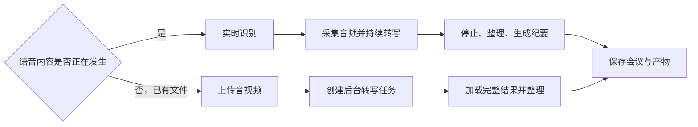
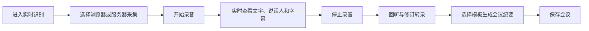

# WYL ASR 操作说明书

**文档版本**：V1.4
**编写日期**：2026-06-24
**适用范围**：WYL ASR Web 管理端、实时/上传识别、会议资料、会议纪要及字幕客户端

---

## 1. 文档说明

本文档面向日常使用人员，重点说明以下内容：

- 如何启动前端和后端服务
- 如何使用“实时转写”处理正在进行的会议
- 如何使用“上传音视频转文字”处理已有文件
- 如何选择不同会议纪要模板
- 如何设置说话人、串口和热词
- 如何修订转录、管理纪要版本、生成情绪分析
- 如何保存、预览、分享、下载和管理会议资料
- 如何使用桌面、Android、iOS 和轻量滚动字幕客户端
- 常见问题的处理方法

如需开发或部署细节，请结合项目 `README.md` 使用。

系统有两个并列的核心入口：

| 核心功能 | 什么时候使用 | 是否要求持续连接 |
|----------|--------------|------------------|
| 实时转写 | 会议正在进行，需要边说边显示文字或字幕 | 是，需要保持 WebSocket 和音频采集 |
| 上传音视频转文字 | 音频或视频已经存在，需要完整离线转录 | 否，提交后台任务后可按任务状态查询 |

---

## 2. 使用前准备

### 2.1 环境准备

使用前请确认以下条件已满足：

- 已安装 Python 运行环境，并可正常执行 `python main.py`
- 已准备前端运行环境，可执行 `npm run dev`
- 浏览器建议使用 Chrome 或 Edge
- 电脑麦克风可正常使用，浏览器已授予录音权限
- 如需上传视频或非 WAV 音频，建议确认 FFmpeg 可用，或使用仓库内置 `tools/bin/ffmpeg`
- 如需运行独立字幕客户端，请安装 .NET 8.0 SDK
- 如需构建 Android 客户端，请额外安装 .NET Android 工作负载和 Android SDK
- 如需构建 iOS 客户端，请在 macOS 安装 Xcode 和 .NET iOS 工作负载

### 2.2 默认服务地址

系统默认使用以下端口：

| 服务 | 默认地址 |
|------|----------|
| 前端开发页面 | `http://localhost:5173` |
| WebSocket 识别服务 | `ws://localhost:10095` |
| API 服务 | `http://localhost:8080` |
| 健康检查 | `http://localhost:8080/api/health` |

> 如果服务器部署在其他机器上，请将 `localhost` 替换为对应服务器 IP。

### 2.3 首次使用前下载模型

首次运行建议先下载模型：

```bash
cd wyl_asr
python organize_models.py
```

看到模型下载完成提示后再继续后续操作。

### 2.4 API 鉴权说明

如部署人员设置了环境变量 `WYL_ASR_API_KEY`，浏览器、客户端或第三方调用 `/api` 接口时必须携带以下任意一种请求头：

```text
X-API-Key: 配置的密钥
Authorization: Bearer 配置的密钥
```

未启用该环境变量时，系统不会强制 API Key。生产环境还应通过 `WYL_ASR_CORS_ORIGINS` 限制允许访问 API 的前端来源。

---

## 3. 系统启动与停止

### 3.1 启动前端

首次运行：

```bash
cd wyl_asr/ui
npm install
npm run dev
```

启动完成后，在浏览器打开：

```text
http://localhost:5173
```

### 3.2 启动后端

当前版本推荐先打开前端，再通过“系统设置”页面启动后端。

操作步骤：

1. 打开首页
2. 点击左侧 `系统设置`
3. 根据需要调整主机、端口、模型、硬件参数
4. 点击 `直接启动服务` 或 `保存并启动`

如页面启动失败，可按页面提示复制命令，在终端手动执行。例如：

```bash
cd wyl_asr
conda activate funasr-ws
python main.py --host 0.0.0.0 --port 10095 --api-port 8080
```

### 3.3 启动成功标志

后端正常启动后，终端通常会出现类似日志：

```text
🌐 启动数据库API服务器: http://0.0.0.0:8080
🔗 API服务器已在后台启动
⚡ 服务器已就绪，等待客户端连接...
```

### 3.4 停止服务

- 停止前端：在前端运行终端按 `Ctrl + C`
- 停止后端：在后端运行终端按 `Ctrl + C`

### 3.5 系统设置项目

`系统设置` 页面可集中配置并启动后端：

| 分类 | 主要配置 |
|------|----------|
| 网络 | 主机、WebSocket 端口、API 端口、SSL 证书和私钥 |
| 模型 | SenseVoice/Paraformer、在线/离线 ASR、VAD、标点、量化 |
| 识别 | 在线、离线、2pass 双通道 |
| 硬件 | CPU、CUDA、MPS、GPU 数量、CPU 核数、批大小 |
| 说话人 | 声纹验证、说话人分离、匹配阈值 |
| 翻译 | 翻译开关和翻译模型 |
| 性能 | 输入输出、解码和模型线程数 |

操作按钮说明：

- `直接启动服务`：使用页面当前参数启动，不先写入配置
- `保存并启动`：先保存配置，再启动服务
- `保存配置`：仅保存，不启动
- `加载配置`：读取已有配置
- `恢复默认`：恢复页面默认值

---

## 4. 首页功能

首页主要包括左侧菜单、快速流程入口和右侧会议列表。

### 4.1 左侧菜单

| 菜单 | 作用 |
|------|------|
| `开始录音` | 新建会议并进入录音页面 |
| `说话人注册` | 录音或上传样本注册声纹，查看和删除已注册说话人 |
| `热词设置` | 管理识别热词及权重 |
| `系统设置` | 配置并启动后端服务 |
| `字幕设置` | 调整字幕相关显示配置 |

### 4.2 快速流程入口

首页提供两个同等重要的核心工作流入口：

| 入口 | 适用场景 | 结果 |
|------|----------|------|
| `实时识别` | 现场会议、边说边转写 | 进入实时转录工作台，使用麦克风或服务器采集生成转录 |
| `上传音视频` | 已有录音、会议视频、离线文件 | 进入上传识别工作台，上传文件后生成转写、说话人分段和会议纪要 |

选择原则：

- 内容正在发生，需要现场字幕或即时记录：选择 `实时识别`
- 内容已经录制完成，文件保存在本地：选择 `上传音视频`
- 不要为了转写已有文件而播放文件并让麦克风重新收音，这会增加噪声、耗时和识别误差



### 4.3 右侧会议列表

会议列表支持以下操作：

- `搜索`：按会议名称或时间过滤记录
- `查看`：打开会议详情页
- `分享`：弹出分享信息；是否可直接对外访问取决于当前部署环境
- `下载`：下载音频/视频、转录 Word/PDF 或会议纪要 Word/PDF
- `删除`：删除该条会议记录
- `批量下载`：导出当前页面中的会议记录文本

---

## 5. 核心功能一：实时转写

实时转写适合正在进行的会议、访谈和现场字幕。系统持续采集音频并返回识别文字，停止录音后再统一整理、生成纪要和保存。



### 5.1 进入录音页面

在首页点击 `开始录音`，系统会自动生成会议标题和文件名，并打开录音页面。

### 5.2 页面布局说明

录音页面主要分为两部分：

- 左侧：实时转录区
- 右侧：会议纪要编辑区

页面顶部可编辑会议标题，右上角有 `保存会议` 按钮。

### 5.3 选择采集方式

底部控制区可切换音频采集模式：

| 模式 | 说明 |
|------|------|
| `浏览器采集` | 由浏览器读取本机麦克风，适合普通使用场景 |
| `服务器采集` | 由服务器端采集音频，适合特殊硬件接入场景 |

如果使用 `浏览器采集`，请确认浏览器已授权麦克风权限，并在设置中选择正确的音频设备。

### 5.4 开始与停止录音

操作步骤：

1. 检查标题、文件名和采集模式
2. 点击右下角圆形录音按钮开始录音
3. 录音过程中观察左侧转录内容，必要时调整麦克风、说话人或热词配置
4. 会议结束后再次点击录音按钮停止录音
5. 检查转录内容，确认无明显缺失后再生成纪要或保存会议

### 5.5 生成会议纪要

录音结束后，可以基于当前转录内容生成会议纪要。

操作步骤：

1. 确认右侧 `会议纪要` 区域为显示状态
2. 点击右下角齿轮图标打开 `系统设置`
3. 在 `会议纪要模型服务配置` 中确认服务类型、模型和接口参数
4. 在 `纪要模板` 中选择需要的模板
5. 点击 `测试生成纪要`
6. 等待生成完成后，在右侧纪要区查看和修订内容

内置模板说明：

| 模板 | 适用场景 | 内容特点 |
|------|----------|----------|
| `标准会议纪要` | 例会、沟通会、普通会议 | 按摘要、议题、决议、待办和后续安排组织 |
| `方案评审纪要` | 方案评审会、产品需求会、系统优化评审 | 按主题和方案归类，突出会议主题、发言人、摘要和待办 |

模板选择会保存在浏览器本地，下次生成纪要时默认沿用上次选择。

### 5.6 保存会议

确认转录和会议纪要后，点击页面右上角 `保存会议`。

保存后系统会记录：

- 会议标题和时间
- 转录文本
- 说话人分段
- 会议纪要
- 本次实时录音文件信息

### 5.7 转录内容整理

录音停止并生成音频后，可以继续整理转录：

- 点击说话人名称进行更名或注册声纹
- 点击时间戳跳转到对应音频位置回听
- 使用查找和替换批量修正常见错词
- 手动指定当前发言人；需要恢复自动判断时选择恢复串口/自动识别
- 下载或播放当前会议音频，核对关键内容

> 涉及音频片段的说话人注册通常需要先停止录音，确保对应片段已保存。

---

## 6. 核心功能二：上传音视频转文字

上传音视频转文字适用于已有录音、会议视频、课程录像、访谈素材和历史音频。系统会保存源文件，创建后台任务，将媒体转换为统一音频格式，再执行整文件识别、说话人处理和文本整理。

这条链路与实时转写相互独立：上传任务通过 REST API 执行，不需要打开麦克风，也不会占用实时转写连接的识别缓存。


### 6.1 进入上传识别

操作步骤：

1. 打开首页
2. 点击 `上传音视频`
3. 进入上传识别工作台

页面标题通常会自动生成类似“某年某月某日上传识别”的名称，也可以在顶部手动修改。

### 6.2 上传前配置

上传区域提供以下配置：

| 配置 | 说明 |
|------|------|
| `识别语言` | 根据文件内容选择中文、自动识别、英文、粤语、日语或韩语等可用语言 |
| `预计人数` | 可留空自动判断，也可填写固定人数或范围，例如 `2`、`2-4` |
| `热词范围` | 选择本次上传识别要使用的热词分类 |
| `说话人分离` | 区分文件中的不同声音并生成临时说话人 |
| `声纹匹配` | 开启后从多个片段中尝试把临时说话人匹配为已注册人员 |
| `中英翻译` | 开启后生成原文和译文 |

配置建议：

- 单人录音可填写 `1`，减少不必要的多人分离
- 明确知道参会人数时填写固定人数；不确定时填写范围
- 人名、产品名和专业术语应提前加入热词，并选择对应热词范围
- 只需要区分“说话人1、说话人2”时开启说话人分离即可
- 需要自动显示“张三、李四”等实名时，还要提前注册声纹并开启声纹匹配
- 翻译会增加处理时间，不需要译文时建议关闭

### 6.3 选择文件并等待识别

操作步骤：

1. 点击 `选择文件` 或底部 `上传音视频识别`
2. 选择本地音频或视频文件
3. 确认文件名和当前识别配置
4. 提交后系统创建后台任务并返回任务编号
5. 保持页面打开，查看进度弹窗中的当前阶段和百分比
6. 如选错文件或参数，可在任务完成前点击 `取消识别`
7. 状态变为成功后，全文和分段结果会自动加载到左侧内容区

常见支持格式包括 `.wav`、`.mp3`、`.m4a`、`.flac`、`.mp4`、`.mov`、`.mkv`、`.avi` 等。视频文件会先抽取音轨再识别。

上传前检查：

- 文件能够在本机正常播放
- 文件大小未超过部署方配置的上限，默认上限为 2048MB
- 视频确实包含可用音轨
- 文件没有被其他程序独占或损坏
- 服务端磁盘有足够空间保存源文件和转换后的 WAV

### 6.4 识别阶段与任务状态

进度弹窗会显示任务状态、当前阶段和百分比：

| 状态 | 页面含义 | 用户操作 |
|------|----------|----------|
| `queued` | 文件已保存，正在等待后台任务执行 | 正常等待；任务较多时会排队 |
| `running` | 正在转换、识别或后处理 | 查看阶段和进度，可按需要取消 |
| `succeeded` | 转写完成，结果可以加载 | 进入结果整理和纪要生成 |
| `failed` | 转换、模型或后处理发生错误 | 查看错误原因，修正后重新上传 |
| `cancelled` | 当前任务已取消 | 重新选择文件并创建新任务 |

常见处理阶段：

1. `正在准备音视频文件`：保存文件并读取媒体信息
2. 媒体转换：将视频音轨或非标准音频转为 16kHz 单声道 WAV
3. ASR 识别：上传专用 SenseVoiceSmall 对整文件执行识别
4. 说话人处理：生成时间戳分段，按需要执行声纹匹配
5. 翻译与文本整理：生成译文、清理纯语气词和明显重复内容
6. 结果保存：写入全文、分段、媒体引用和识别元数据

> 上传结果出现很多分段并不表示文件被拆成很多次主识别。主 ASR 仍按整文件执行，分段用于显示、回听和说话人整理。

### 6.5 查看识别结果

上传识别完成后可以进行以下操作：

- 查看不带界面标记的完整转录文本
- 查看按说话人和时间范围拆分的段落
- 查看整段或逐段译文
- 播放原始上传音视频
- 点击时间戳跳转到对应位置回听
- 试听系统为说话人整理生成的候选片段
- 查看源媒体时长、格式、编码和文件大小等信息

结果中常见内容：

| 内容 | 作用 |
|------|------|
| 完整原文 | 作为会议纪要、全文搜索和文档导出的基础 |
| 说话人分段 | 显示每段由谁发言以及开始、结束时间 |
| 原始媒体 | 用于播放、核对和下载 |
| 识别 WAV | 作为统一时间基准，用于片段试听和声纹注册 |
| ASR 元数据 | 记录时间戳、说话人数、分段来源和后处理情况 |

### 6.6 整理说话人与文本

建议先整理说话人，再生成会议纪要：

- 点击 `说话人整理` 对候选说话人进行试听、合并、更名
- 对单个归属错误的段落修改说话人
- 将实际属于同一个人的两个临时说话人合并
- 从高质量片段注册说话人声纹
- 使用查找和替换统一修正人名、产品名和专业术语
- 点击 `重新上传` 替换文件重新识别

整理结果会立即回写到当前上传转写内容。完成整理后建议再生成会议纪要。

说话人处理说明：

- “说话人分离”负责区分不同声音
- “实名声纹匹配”负责尝试识别具体姓名
- “人工整理”用于最终确认，人工结果应作为正式归档依据

### 6.7 基于上传结果生成会议纪要

上传音视频转文字完成后，生成纪要的方法和实时录音一致：

1. 打开右下角 `系统设置`
2. 确认 `会议纪要区域` 为显示状态
3. 选择 `纪要模板`
4. 点击 `测试生成纪要`
5. 检查并修订右侧会议纪要
6. 点击右上角 `保存识别结果`

模板说明：

| 模板 | 适用场景 | 输出重点 |
|------|----------|----------|
| `标准会议纪要` | 日常例会、沟通会、访谈整理 | 摘要、议题、决议、待办和后续安排 |
| `方案评审纪要` | 产品、技术、建设方案和需求评审 | 按主题归类方案、发言人、结论、风险和待办 |

长文件对应的转录文本超过模型上下文时，系统会先分段总结，再使用所选模板合并成正式纪要。生成后仍需人工核对姓名、数字、日期、结论和待办责任人。

### 6.8 保存后的会议产物

点击 `保存识别结果` 后，该记录会以“上传识别”来源进入会议列表，并关联：

- 原始音频或视频
- 转换后的识别音频引用
- 完整转录稿
- 带时间戳的说话人分段
- 可选逐段译文
- 当前会议纪要及后续版本

进入会议详情后，可以继续播放或下载源媒体、按时间戳回听、修改转录、生成新版纪要、生成情绪分析并导出 Word/PDF。

### 6.9 失败、取消与重新识别

任务失败时按页面错误信息检查：

1. 文件类型是否受支持，文件是否可以正常播放
2. 视频是否包含音轨，FFmpeg 是否可用
3. 文件是否超过上传大小限制
4. 上传专用模型是否已加载
5. 预计人数是否设置得过窄
6. 服务器磁盘、内存或 GPU/MPS 资源是否充足

处理后点击 `重新上传` 创建新任务。取消或失败的任务不会自动作为正式会议保存；如页面已有部分文本，也应以重新识别成功后的完整结果为准。

---

## 7. 说话人和串口设置

### 7.1 指定参会人

录音或上传识别过程中，如果系统未能自动识别正确说话人，可以在说话人相关弹窗中手动指定参会人。

常见用途：

- 临时指定当前发言人
- 修正自动匹配错误的说话人名称
- 在没有声纹样本时先用人工名称标注

### 7.2 说话人声纹注册

系统支持通过录音或上传音频片段注册说话人声纹。注册后，后续实时识别和上传识别可以尝试自动匹配人员身份。

操作方式一，现场录音注册：

1. 进入 `说话人注册`
2. 填写说话人名称和说明
3. 选择录音方式并录制一段清晰语音
4. 停止录音后提交注册
5. 在说话人列表中确认记录已生成

操作方式二，文件或会议片段注册：

1. 在说话人注册页上传单人语音文件，或在上传识别的 `说话人整理` 中选择候选片段
2. 填写说话人名称
3. 如名称已存在，根据提示选择是否覆盖
4. 提交后刷新说话人列表

建议：

- 每位说话人尽量提供清晰、无背景噪声的样本
- 样本中尽量只包含一个人的声音
- 上传识别完成后，可从高质量候选片段中直接注册声纹

### 7.3 串口配置注意事项

如果现场设备需要通过串口单元号绑定说话人，请先确认串口设备已连接，并在系统中完成对应绑定。

> 修改串口配置后，需要重启 ASR 服务器才能生效。

### 7.4 单元号绑定

页面支持：

- 搜索单元号或说话人
- 编辑绑定关系
- 批量设置绑定关系
- 切换串口/手动说话人模式
- 修改串口参数
- `保存全部`
- `刷新`

### 7.5 查看系统可用串口

如需在终端查看当前可用串口，可执行：

```bash
cd wyl_asr
python main.py --list_serial_ports
```

如不需要串口功能，可使用：

```bash
python main.py --disable_serial
```

### 7.6 会后修正说话人

在会议详情页打开转录资料后，可进入说话人校正面板：

1. 选择需要修正的说话人或分段
2. 修改名称，或把多个临时说话人合并为同一人
3. 逐段核对时间和文本
4. 保存校正后的转录文档
5. 如纪要依赖旧转录内容，建议重新生成纪要或情绪分析

---

## 8. 热词设置

热词用于提升专有名词、产品名、人名等内容的识别准确率。

### 8.1 进入页面

首页点击 `热词设置`。

### 8.2 常用操作

页面支持以下功能：

- 新增热词
- 设置 `1-100` 权重
- 设置分类、来源、保护状态和说明
- 编辑热词
- 删除热词
- 保存热词
- 刷新热词
- 搜索并按分类、来源、保护状态和权重筛选
- 清空未保护热词
- 导出识别用 TXT 或资产 JSON
- 导入 TXT、CSV、JSON
- 点击预设热词快速加入

### 8.3 权重说明

热词权重范围通常为 `1` 到 `100`：

- 权重越高，识别时越容易命中该词
- 建议优先给关键人名、项目名、术语更高权重

### 8.4 生效建议

修改热词后建议：

1. 先点击 `保存热词`
2. 再开始新的录音任务

上传识别时可在 `热词范围` 中选择本次任务使用的分类。受保护热词不能直接删除，批量替换或清空时也会保留。

### 8.5 导入和导出

导入操作：

1. 点击 `导入热词`
2. 选择 TXT、CSV 或 JSON 文件
3. 选择合并现有热词，或替换未保护热词
4. 检查导入结果并保存

导出操作：

- 选择 TXT：用于识别服务直接加载
- 选择 JSON：保留分类、来源、保护状态和说明等资产信息

---

## 9. 会议纪要与录音页系统设置

### 9.1 录音页系统设置

录音页右下角有一个齿轮图标按钮，点击后弹出 `系统设置` 面板。以下逐项说明面板中的各个配置项。

#### 9.1.1 识别模式

用于选择语音识别引擎的工作模式，不同模式在延迟和准确率之间有所取舍。

| 模式 | 值 | 说明 |
|------|------|------|
| `双通道模式` | `2pass` | **默认推荐**。先快速输出在线结果，再用离线模型修正，兼顾实时性和准确率 |
| `在线模式` | `online` | 仅使用流式在线模型，延迟最低，但准确率略低 |
| `离线模式` | `soffline` | 仅使用离线模型，准确率最高，但需等待较长时间才输出结果 |

> 大多数会议场景建议使用 `双通道模式`。如果网络延迟敏感或仅做简单速记，可选 `在线模式`。

#### 9.1.2 识别语言

用于指定语音识别所使用的语言，支持以下选项：

| 选项 | 值 | 说明 |
|------|------|------|
| `中文` | `zh` | **默认值**。适用于普通话会议 |
| `自动检测` | `auto` | 系统自动判断语种，适合多语言混合场景 |
| `英文` | `en` | 纯英文会议 |
| `粤语` | `yue` | 粤语会议 |
| `日语` | `ja` | 日语会议 |
| `韩语` | `ko` | 韩语会议 |

> 切换语言后，页面会弹出提示确认当前语言已更新。建议在开始录音前设置好语言，录音过程中切换可能影响识别效果。

#### 9.1.3 音频设备

用于选择当前使用的麦克风或音频输入设备。

- **浏览器采集模式**：下拉列表显示的是浏览器检测到的本机音频输入设备（如内置麦克风、USB 麦克风、蓝牙设备等）。使用前请确保浏览器已授权麦克风权限。
- **服务器采集模式**：下拉列表显示的是服务器端可用的音频设备，由服务器负责采集音频，浏览器不传输音频数据。

> 如果下拉列表为空，请检查设备是否已连接、浏览器是否已授权音频权限，或刷新页面重试。

#### 9.1.4 说话人识别开关

控制是否启用说话人分离（Speaker Diarization）功能。

| 状态 | 效果 |
|------|------|
| `启用` | 转录结果按不同说话人分段展示，每段标注说话人名称和时间范围，支持点击名称修改和注册 |
| `禁用` | 转录结果以纯文本方式连续展示，不区分说话人 |

> 启用说话人识别后，如果已注册了说话人声纹或绑定了串口单元号，系统会自动尝试匹配说话人身份。

#### 9.1.5 说话人设置入口

点击 `去配置` 链接按钮，可跳转到说话人声纹注册与管理页面。在该页面可以：

- 注册新说话人的声纹
- 查看和删除已注册的说话人
- 管理说话人描述信息

> 该入口等同于从"指定参会人"弹窗中点击"没有合适参会人？去说话人设置"的效果。

#### 9.1.6 中英翻译开关

控制是否对识别结果进行中英互译。

| 状态 | 效果 |
|------|------|
| `启用` | 每段转录文字下方会额外显示翻译结果，中文识别时翻译为英文，英文识别时翻译为中文 |
| `禁用` | 仅显示原始识别文字，不进行翻译 |

> 翻译功能需要后端翻译服务支持。启用后会增加一定的处理延迟。该设置会保存到浏览器本地存储，下次打开时自动恢复。

#### 9.1.7 会议纪要区域显示或隐藏

控制录音页面右侧的会议纪要编辑区域是否可见。

| 状态 | 效果 |
|------|------|
| `显示` | 页面右侧显示会议纪要编辑区域，同时设置面板下方会展开"会议纪要模型服务配置"选项 |
| `隐藏` | 右侧纪要区域收起，页面只保留左侧转录区域，设置面板中也不显示 LLM 配置项 |

> 如果本次会议不需要生成纪要，可以隐藏该区域以获得更大的转录查看空间。

#### 9.1.8 会议纪要模型服务配置

> 此配置区域仅在"会议纪要区域"开关为 `显示` 时才可见。

会议纪要功能依赖大语言模型（LLM）进行内容总结和纪要生成。系统支持接入以下四种推理服务框架，用户需根据实际部署的模型服务进行配置：

**支持的服务类型：**

| 服务类型 | 说明 | 默认端口 | API 风格 |
|---------|------|---------|---------|
| `Ollama` | 轻量级本地模型运行框架，适合个人或小团队部署 | 11434 | 自有 API（`/api/chat`） |
| `Xinference` | 分布式模型推理平台，支持多种模型格式 | 9997 | OpenAI 兼容 |
| `vLLM` | 高性能推理引擎，支持批处理和 PagedAttention | 8000 | OpenAI 兼容 |
| `SGLang` | 高效推理框架，支持结构化生成和 RadixAttention | 30000 | OpenAI 兼容 |

**各服务的配置项：**

**Ollama：**

| 配置项 | 说明 | 示例 |
|--------|------|------|
| 服务端点 | Ollama 的 API 聊天接口地址 | `https://10.1.0.27/ollama/api/chat` |
| 模型名称 | 已通过 `ollama pull` 下载的模型名 | `qwen3:30b-a3b-q4_K_M` |

> Ollama 不需要 API 密钥。开发环境会自动使用代理避免 CORS 问题。使用前请确保已运行 `ollama serve` 并已下载所需模型（`ollama pull 模型名`）。

**Xinference：**

| 配置项 | 说明 | 示例 |
|--------|------|------|
| API 端点 | Xinference 的 OpenAI 兼容接口地址 | `http://localhost:9997/v1/chat/completions` |
| 模型名称 | 已在 Xinference 中部署的模型名 | `qwen-chat` |
| API 密钥 | 可选，根据 Xinference 服务端安全配置决定是否需要 | — |

**vLLM：**

| 配置项 | 说明 | 示例 |
|--------|------|------|
| API 端点 | vLLM 的 OpenAI 兼容接口地址 | `http://localhost:8000/v1/chat/completions` |
| 模型名称 | vLLM 启动时加载的模型路径或名称 | `meta-llama/Llama-2-7b-chat-hf` |
| API 密钥 | 可选，根据 vLLM 服务端安全配置决定是否需要 | — |

> vLLM 启动命令参考：`python -m vllm.entrypoints.openai.api_server`。vLLM 适合需要高吞吐量推理的场景。

**SGLang：**

| 配置项 | 说明 | 示例 |
|--------|------|------|
| API 端点 | SGLang 的 OpenAI 兼容接口地址 | `http://localhost:30000/v1/chat/completions` |
| 模型名称 | SGLang 启动时加载的模型路径或名称 | `meta-llama/Llama-2-7b-chat-hf` |
| API 密钥 | 可选，根据 SGLang 服务端安全配置决定是否需要 | — |

> SGLang 启动命令参考：`python -m sglang.launch_server`。SGLang 特别适合需要结构化输出的场景。

**如何选择服务类型：**

- 如果只有一台普通电脑，推荐使用 `Ollama`，安装简单、开箱即用
- 如果需要高并发推理或批处理，推荐使用 `vLLM`
- 如果需要结构化生成输出，推荐使用 `SGLang`
- 如果已有 Xinference 集群环境，直接使用 `Xinference`

配置完成后，可点击面板底部的 `测试生成纪要` 按钮进行验证。

### 9.2 纪要模板选择

`会议纪要模型服务配置` 中提供 `纪要模板` 下拉框。生成纪要前请根据会议类型选择模板：

| 模板 | 推荐使用场景 | 说明 |
|------|--------------|------|
| `标准会议纪要` | 日常例会、工作沟通会、普通会议 | 保留原有结构化纪要格式，包含摘要、议题、决议、待办等内容 |
| `方案评审纪要` | 方案评审、产品需求评审、系统优化评审 | 按主题和方案归类，输出会议主题、发言人、会议摘要和待办事项 |

注意事项：

- 模板选择会自动保存到浏览器本地
- 下次生成会议纪要时会默认沿用上次选择
- 长会议进入分段处理时，最终合并后的正式纪要会按当前模板输出

### 9.3 生成会议纪要

当前版本在录音页或上传识别页的设置面板中使用 `测试生成纪要` 按钮。

这个按钮的作用是：

1. 校验当前 LLM 服务是否可用
2. 使用当前转录内容和已选择模板生成会议纪要
3. 将结果写入右侧纪要编辑区

使用建议：

1. 先完成录音或上传识别，确保已有有效转录
2. 打开 `系统设置`
3. 配置 LLM 服务参数
4. 选择合适的 `纪要模板`
5. 点击 `测试生成纪要`
6. 等待右侧生成内容

### 9.4 编辑纪要

右侧纪要区支持继续手动编辑。

常见做法：

- 调整标题和分段
- 补充待办事项
- 修改责任人和时间点

编辑完成后，实时录音页面点击右上角 `保存会议`，上传识别页面点击 `保存识别结果`，保存最终内容。

---

## 10. 历史会议管理

### 10.1 查看会议详情

在首页会议列表点击 `查看`，可进入会议详情页。

详情页以会议资料时间线组织内容，通常包括：

- 会议基础信息
- 原始音频或视频
- 转录文档
- 会议纪要及历史版本
- 情绪分析
- 其他会议文档

点击左侧资料项后，右侧显示预览、生成、修订或下载操作。

### 10.2 播放和定位原始媒体

1. 在资料时间线选择原始音频或视频
2. 使用播放器进行播放、暂停和进度定位
3. 在转录中点击时间戳，可跳转到对应媒体位置
4. 需要归档时点击下载原始媒体

### 10.3 修订转录和说话人

1. 选择 `转录文档`
2. 打开说话人校正或编辑入口
3. 修改说话人名称、合并临时说话人或修正文稿
4. 保存校正后的转录
5. 返回资料预览确认内容

### 10.4 管理会议纪要版本

会议纪要支持多个版本：

1. 选择 `会议纪要`
2. 如尚未生成，先选择模板并生成纪要
3. 在版本列表中切换查看不同版本
4. 选择需要作为当前正式版本的纪要
5. 输入自然语言修订要求，例如“补充每项任务的责任人和截止时间”
6. 提交后系统生成新版本，原版本继续保留
7. 下载当前版本或指定版本

### 10.5 生成情绪分析

1. 选择 `情绪分析`
2. 点击 `生成情绪分析`
3. 等待系统基于转录按说话人生成分析
4. 查看情绪基调、压力或风险、不确定性和协作信号
5. 转录发生较大修订后，可点击 `重新生成情绪分析`

情绪分析用于会议复盘和辅助判断，不应作为医学或人事结论。

### 10.6 下载和导出

首页和详情页都支持下载：

- 原始音频或上传视频
- 转录 Word/PDF
- 会议纪要 Word/PDF
- 情绪分析 Word/PDF
- 其他会议文档

如果某类文件尚未生成，对应按钮可能不可用。

### 10.7 分享会议

1. 在首页会议列表点击 `分享`
2. 查看系统生成的二维码或分享链接
3. 复制链接或由参会者扫码

分享地址能否被其他设备访问，取决于服务器地址、防火墙、网络和分享服务配置。仅在受信任网络中分享敏感会议资料。

### 10.8 删除会议

点击 `删除` 后系统会二次确认，确认后该会议记录将被移除。

### 10.9 批量下载

首页顶部支持 `批量下载`，用于导出当前页面中可见会议的文本信息。

---

## 11. 字幕设置与客户端使用

### 11.1 Web 字幕设置

在首页设置菜单选择 `字幕设置`，可调整：

- 窗口宽度、圆角
- 背景颜色和透明度
- 字体、字号、颜色、粗体和斜体
- 是否显示英文/译文
- 最大显示行数和滚动速度
- WebSocket 地址

保存后，设置写入后端，并广播给当前已连接的字幕客户端。

### 11.2 桌面悬浮字幕客户端

开发模式启动：

```bash
cd VoiceRecognitionDisplay
dotnet run --project VoiceRecognitionDisplay.Desktop/VoiceRecognitionDisplay.Desktop.csproj
```

使用步骤：

1. 启动 WYL ASR 后端
2. 启动客户端，点击 `设置`
3. 将 WebSocket 地址改为实际服务地址，例如 `ws://192.168.1.100:10095`
4. 保存设置，客户端会重新连接
5. 在 Web 端开始实时识别
6. 拖动悬浮窗口到合适位置，观察实时字幕
7. 需要时切换双语、行数、字体、背景和透明度
8. 点击 `分享` 查看二维码和链接；点击关闭按钮退出

桌面端支持 Windows、macOS 和 Linux。窗口位置和显示配置会保存在当前用户的应用配置目录。

### 11.3 Android 悬浮字幕客户端

构建 APK：

```bash
cd VoiceRecognitionDisplay
./build-android.sh
```

首次使用：

1. 将生成的 APK 安装到 Android 设备
2. 打开“智能会议”
3. 按系统提示授予 `显示在其他应用上层` 权限
4. 允许前台服务通知
5. 在设置中填写 WYL ASR WebSocket 地址
6. 启动悬浮字幕服务
7. 切换到其他会议或投屏应用，字幕仍显示在屏幕上层

通知栏显示“字幕悬浮窗正在运行”时，说明前台服务仍在工作。停止服务或关闭应用后悬浮窗消失。

### 11.4 iOS 字幕客户端

构建客户端：

```bash
cd VoiceRecognitionDisplay
dotnet build VoiceRecognitionDisplay.iOS/VoiceRecognitionDisplay.iOS.csproj -c Release
```

使用步骤：

1. 在 macOS/Xcode 环境完成应用签名并安装到 iPhone 或 iPad
2. 启动 WYL ASR 后端和 iOS 客户端
3. 在客户端设置中填写 WebSocket 服务地址
4. 保存配置并确认连接成功
5. 在 Web 端开始实时识别
6. 查看原文、译文和当前说话人字幕
7. 根据需要调整字体、颜色、背景、行数和滚动参数

### 11.5 轻量滚动字幕客户端

该客户端适合大屏、第二显示器和 OBS 窗口采集：

```bash
cd subtitle_display
dotnet restore
dotnet run
```

操作步骤：

1. 输入 WebSocket 地址，默认可使用 `ws://localhost:10095`
2. 点击 `连接`
3. 在 Web 端开始实时识别
4. 字幕按说话人连续累加并自动换行、滚动
5. 点击 `清空` 删除当前显示内容
6. 点击 `断开` 结束连接

### 11.6 客户端连接其他服务器

当客户端和服务器不在同一台设备时：

1. 把 `localhost` 改为服务器局域网 IP 或域名
2. 确认服务器监听地址为 `0.0.0.0`
3. 确认 `10095` 端口未被防火墙阻止
4. HTTPS 部署使用对应的 `wss://` 地址和有效证书
5. 手机与服务器需处于可互通网络

---

## 12. 常见问题

### 12.1 API 端口 8080 被占用

现象：

```text
Address already in use
Port 8080 is in use by another program
```

处理方法：

- 停止占用 `8080` 的程序
- 或在 `系统设置` 中修改 `API端口` 后重新启动服务

### 12.2 开始录音后没有识别结果

请依次检查：

1. 后端是否正常启动
2. 浏览器是否授权麦克风
3. 是否选择了正确的音频设备
4. 当前识别服务地址和端口是否正确

### 12.3 指定参会人没有生效

请确认：

- 已点击 `确认指定`
- 当前正在使用同一个录音会话
- 如需恢复自动判断，已点击 `恢复串口`

说明：

- 手动指定只作用于当前录音会话
- 不会改写全局串口绑定配置

### 12.4 修改串口配置后没有变化

原因通常是串口配置需要重启后端才会生效。

处理方法：

1. 保存串口配置
2. 停止当前 ASR 服务
3. 重新启动后端

### 12.5 说话人名称不能修改或注册

如果是通过转录结果里的说话人名称去做“修改并注册”，需要先停止录音，让系统生成可用音频片段。

### 12.6 没有已注册参会人怎么办

有两种处理方式：

- 在 `指定参会人` 弹窗中直接输入姓名
- 进入 `说话人设置` 先完成声纹注册

### 12.7 会议纪要生成失败

请检查：

- LLM 服务是否已启动
- 服务端点、模型名、API Key 是否正确
- 当前是否已有有效转录内容
- 网络是否可访问对应模型服务

### 12.8 上传音视频识别失败

请检查：

- 上传文件是否为系统支持的音频或视频格式
- 文件是否过大或已损坏
- FFmpeg 是否可用，视频文件是否能正常抽取音轨
- 后端 API 服务是否正常运行
- 进度弹窗最后显示在哪个处理阶段
- 上传专用 SenseVoiceSmall 模型是否已加载
- 预计人数是否设置得过窄
- 如果开启声纹匹配后处理耗时过长，可先关闭 `声纹匹配` 后重试

失败后应重新创建上传任务；不要把失败任务中的临时文本直接作为正式会议记录。

### 12.9 字幕客户端无法连接

请检查：

- WYL ASR 后端是否已启动
- WebSocket 地址是否使用正确端口，通常为 `10095`
- 客户端在其他设备上时是否错误使用了 `localhost`
- 防火墙、路由器或代理是否允许 WebSocket 连接
- 使用 `wss://` 时证书是否有效

### 12.10 Android 悬浮窗不显示

请检查：

- 是否已授予“显示在其他应用上层”权限
- 前台服务通知是否仍存在
- 系统是否限制了应用后台运行或电池优化
- WebSocket 地址和网络是否正确

### 12.11 字幕样式修改后客户端没有更新

1. 确认客户端当前处于已连接状态
2. 在 Web `字幕设置` 中重新保存
3. 检查后端是否正常广播设置消息
4. 仍未更新时，在客户端设置中手动保存一次并重新连接

---

## 13. 快速操作建议

### 13.1 实时会议记录

如果你要进行一次现场会议记录，推荐按下面顺序操作：

1. 启动前端
2. 在 `系统设置` 中启动后端
3. 首页点击 `实时识别` 或左侧 `开始录音`
4. 需要时先 `指定参会人`
5. 录音结束后检查转录内容
6. 在录音页 `系统设置` 中选择 `纪要模板`
7. 点击 `测试生成纪要`
8. 修订右侧纪要内容
9. 点击 `保存会议`
10. 返回首页查看、下载或分享

### 13.2 上传文件转文字并生成纪要

如果你已有录音或会议视频，推荐按下面顺序操作：

1. 启动前端和后端
2. 首页点击 `上传音视频`
3. 设置识别语言、预计人数、热词范围、说话人分离、声纹匹配和中英翻译
4. 点击 `选择文件` 上传本地音频或视频
5. 查看任务阶段和进度，等待状态变为成功
6. 检查完整转录、时间戳、说话人分段和原始媒体
7. 进入 `说话人整理` 进行试听、更名、合并或注册声纹
8. 使用查找替换修正常见错词
9. 在 `系统设置` 中选择 `纪要模板`
10. 点击 `测试生成纪要`，核对并修订内容
11. 点击 `保存识别结果`

### 13.3 实时会议加悬浮字幕

1. 启动 WYL ASR 前端和后端
2. 启动桌面、Android、iOS 或轻量滚动字幕客户端
3. 将客户端 WebSocket 地址设为 WYL ASR 服务地址
4. 确认客户端连接成功
5. Web 端进入 `实时识别` 并开始录音
6. 在 `字幕设置` 中调整外观、行数和双语显示
7. 会议结束后停止录音并保存会议
8. 客户端断开连接或停止 Android 悬浮服务

---

本文档按当前项目代码功能整理，客户端发布包、外网分享地址和移动端签名信息以实际部署环境为准。
